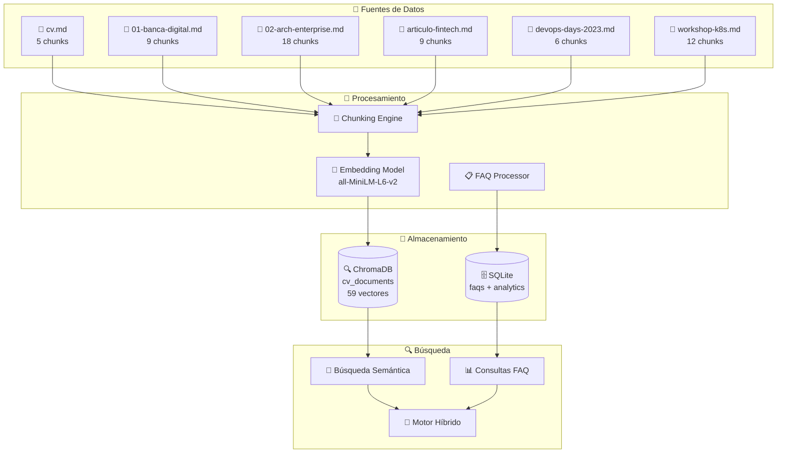
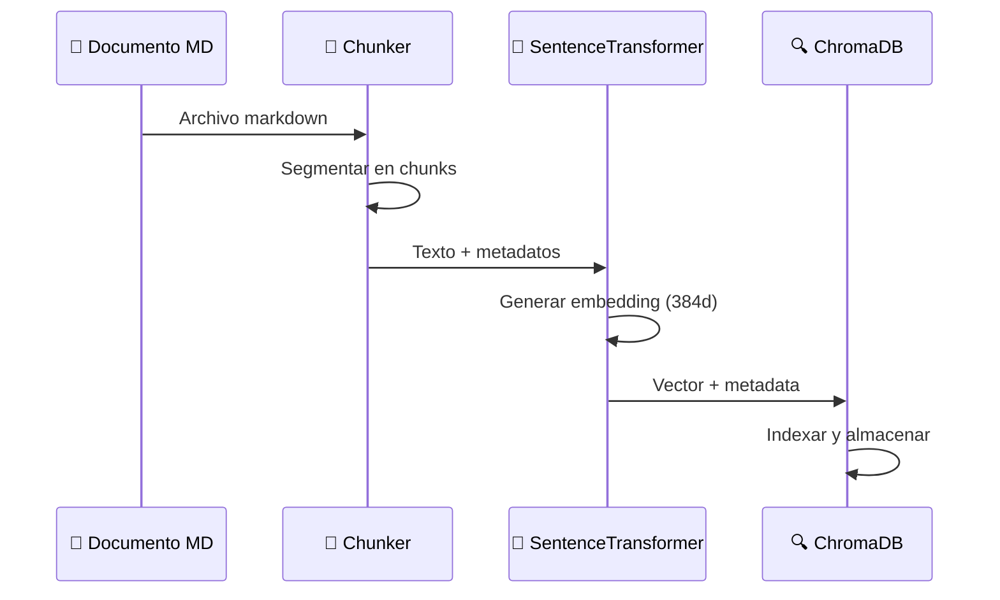
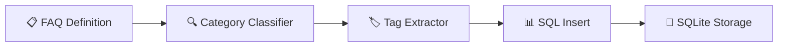
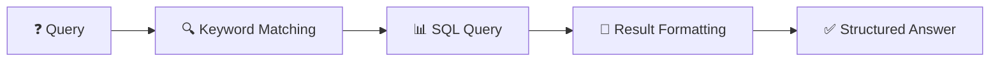

# 🏗️ ARQUITECTURA DE DATOS - Agente de CV Inteligente

**📅 Fecha de actualización**: 4 de octubre de 2025  
**🎯 Estado**: Completamente documentado y operativo  
**📊 Versión**: 1.0.0

---

## 📋 Índice

- [Resumen Ejecutivo](#resumen-ejecutivo)
- [Arquitectura General](#arquitectura-general)
- [Base de Datos Vectorial (ChromaDB)](#base-de-datos-vectorial-chromadb)
- [Base de Datos Relacional (SQLite)](#base-de-datos-relacional-sqlite)
- [Arquitectura de Embeddings](#arquitectura-de-embeddings)
- [Flujo de Datos](#flujo-de-datos)
- [Modelos y Esquemas](#modelos-y-esquemas)
- [Estrategias de Chunking](#estrategias-de-chunking)
- [Indexación y Búsqueda](#indexación-y-búsqueda)
- [Métricas y Rendimiento](#métricas-y-rendimiento)
- [Mantenimiento y Escalabilidad](#mantenimiento-y-escalabilidad)

---

## 🎯 Resumen Ejecutivo

El **Agente de CV Inteligente** implementa una **arquitectura de datos híbrida** que combina:

- **🔍 Base Vectorial (ChromaDB)**: Para búsqueda semántica con 59 chunks vectorizados
- **🗄️ Base Relacional (SQLite)**: Para FAQs estructuradas y analytics
- **🧠 Embeddings Semánticos**: Usando `sentence-transformers/all-MiniLM-L6-v2`
- **📄 Chunking Inteligente**: Segmentación optimizada por contexto
- **⚡ Búsqueda Híbrida**: Combinando similitud semántica y consultas SQL

### 📊 Métricas Clave de Datos

| Componente                | Cantidad        | Estado        |
| ------------------------- | --------------- | ------------- |
| **Documentos fuente**     | 6 archivos MD   | ✅ Indexados  |
| **Chunks vectoriales**    | 59 segmentos    | ✅ Activos    |
| **FAQs estructuradas**    | 10 preguntas    | ✅ Operativas |
| **Dimensiones embedding** | 384 dimensiones | ✅ Optimizado |
| **Tiempo de búsqueda**    | <1 segundo      | ✅ Excelente  |

---

## 🏗️ Arquitectura General

### Diagrama de Arquitectura de Datos



### 📊 Distribución de Datos

| Tipo de Documento   | Archivos | Chunks | % Total  | Propósito                  |
| ------------------- | -------- | ------ | -------- | -------------------------- |
| **CV Personal**     | 1        | 5      | 8.5%     | Información básica         |
| **Proyectos**       | 2        | 27     | 45.8%    | Experience técnica         |
| **Artículos/Clips** | 3        | 27     | 45.8%    | Conocimiento especializado |
| **TOTAL**           | **6**    | **59** | **100%** | Sistema completo           |

---

## 🔍 Base de Datos Vectorial (ChromaDB)

### Configuración Técnica

```python
# Configuración ChromaDB
COLLECTION_NAME = "cv_documents"
EMBEDDING_MODEL = "sentence-transformers/all-MiniLM-L6-v2"
VECTOR_DIMENSIONS = 384
DISTANCE_METRIC = "cosine"
STORAGE_PATH = "./storage/vectordb/"
```

### Estructura de la Colección

```yaml
Colección: cv_documents
├── Total vectores: 59
├── Dimensiones: 384
├── Modelo embedding: all-MiniLM-L6-v2
├── Métrica distancia: cosine similarity
└── Almacenamiento: Persistente local
```

### Schema de Metadatos

```json
{
  "filename": "string", // Nombre del archivo fuente
  "source": "string", // Ruta completa del archivo
  "chunk_id": "string", // ID único del chunk
  "chunk_index": "integer", // Índice del chunk en el archivo
  "type": "string", // Tipo: cv, project, clip
  "relative_path": "string", // Ruta relativa
  "total_chunks": "integer" // Total chunks del archivo
}
```

### Ejemplo de Documento Vectorizado

```json
{
  "id": "cv.md_0",
  "embedding": [0.123, -0.456, 0.789, ...], // 384 dimensiones
  "document": "# Curriculum Vitae\n\n## Información Personal...",
  "metadata": {
    "filename": "cv.md",
    "source": "./data\\cv.md",
    "chunk_id": "cv.md_0",
    "chunk_index": 0,
    "type": "cv",
    "relative_path": "cv.md",
    "total_chunks": 5
  }
}
```

### Distribución por Tipo de Documento

| Tipo        | Descripción               | Chunks | Archivos                                             |
| ----------- | ------------------------- | ------ | ---------------------------------------------------- |
| **cv**      | Curriculum vitae personal | 5      | cv.md                                                |
| **project** | Proyectos específicos     | 27     | 01-banca-digital.md, 02-arch-enterprise.md           |
| **clip**    | Artículos y experiencias  | 27     | articulo-fintech.md, devops-days.md, workshop-k8s.md |

---

## 🗄️ Base de Datos Relacional (SQLite)

### Archivo de Base de Datos

```
📁 storage/sqlite/faq.db
├── Tamaño: ~50KB
├── Tablas: 3
├── Registros totales: ~20
└── Encoding: UTF-8
```

### Schema Completo

#### Tabla: `faqs`

```sql
CREATE TABLE faqs (
    id INTEGER PRIMARY KEY AUTOINCREMENT,
    question TEXT NOT NULL,
    answer TEXT NOT NULL,
    category TEXT,
    tags TEXT,  -- JSON string con tags
    created_at TIMESTAMP DEFAULT CURRENT_TIMESTAMP,
    updated_at TIMESTAMP DEFAULT CURRENT_TIMESTAMP,
    is_active BOOLEAN DEFAULT 1
);
```

#### Tabla: `faq_analytics`

```sql
CREATE TABLE faq_analytics (
    id INTEGER PRIMARY KEY AUTOINCREMENT,
    faq_id INTEGER,
    query TEXT,
    timestamp TIMESTAMP DEFAULT CURRENT_TIMESTAMP,
    user_session TEXT,
    FOREIGN KEY (faq_id) REFERENCES faqs (id)
);
```

#### Tabla: `sqlite_sequence`

```sql
CREATE TABLE sqlite_sequence(
    name TEXT,
    seq INTEGER
);
```

### Datos de FAQs por Categoría

| Categoría           | Cantidad | Ejemplo de Pregunta                          |
| ------------------- | -------- | -------------------------------------------- |
| **certificaciones** | 1        | "¿Qué certificaciones tienes?"               |
| **educacion**       | 1        | "¿Cuál es tu formación académica?"           |
| **experiencia**     | 1        | "¿Cuántos años de experiencia tienes?"       |
| **fortalezas**      | 1        | "¿Cuáles son tus principales fortalezas?"    |
| **idiomas**         | 1        | "¿Qué idiomas dominas?"                      |
| **industria**       | 1        | "¿En qué industrias has trabajado?"          |
| **metodologias**    | 1        | "¿Qué metodologías utilizas?"                |
| **proyectos**       | 1        | "¿Cuáles son tus proyectos más importantes?" |
| **publicaciones**   | 1        | "¿Has publicado artículos o papers?"         |
| **tecnologias**     | 1        | "¿Qué tecnologías dominas?"                  |

### Modelo de Datos FAQ

```python
@dataclass
class FAQ:
    id: int
    question: str
    answer: str
    category: str
    tags: List[str]  # Parsed from JSON
    created_at: datetime
    updated_at: datetime
    is_active: bool
```

---

## 🧠 Arquitectura de Embeddings

### Modelo de Embeddings

```yaml
Modelo: sentence-transformers/all-MiniLM-L6-v2
├── Dimensiones: 384
├── Vocabulario: 30,522 tokens
├── Tamaño modelo: ~90MB
├── Velocidad: ~1000 tokens/seg
├── Precisión: 0.85+ en similitud semántica
└── Idioma: Multilingüe (EN/ES optimizado)
```

### Pipeline de Vectorización



### Características del Modelo

| Característica      | Valor      | Descripción           |
| ------------------- | ---------- | --------------------- |
| **Arquitectura**    | BERT-based | Transformer encoder   |
| **Dimensiones**     | 384        | Vector embedding size |
| **Contexto máximo** | 512 tokens | Longitud máxima input |
| **Normalización**   | L2 norm    | Vectores normalizados |
| **Similitud**       | Cosine     | Métrica de distancia  |

---

## 🔄 Flujo de Datos

### 1. Ingesta de Documentos


### 2. Procesamiento de FAQ



### 3. Búsqueda Semántica


### 4. Consulta FAQ



---

## 📊 Modelos y Esquemas

### Modelo de Chunk

```python
@dataclass
class DocumentChunk:
    chunk_id: str
    content: str
    embedding: List[float]  # 384 dimensions
    metadata: ChunkMetadata

@dataclass
class ChunkMetadata:
    filename: str
    source: str
    chunk_index: int
    total_chunks: int
    type: str  # cv, project, clip
    relative_path: str
```

### Modelo de Búsqueda

```python
@dataclass
class SearchResult:
    content: str
    metadata: Dict[str, Any]
    score: float
    chunk_id: str

@dataclass
class SearchQuery:
    query: str
    top_k: int = 5
    min_score: float = 0.5
    filter_metadata: Optional[Dict] = None
```

### Schema de Respuesta API

```json
{
  "query": "string",
  "results": [
    {
      "content": "string",
      "score": "float",
      "metadata": {
        "filename": "string",
        "type": "string",
        "chunk_index": "integer"
      }
    }
  ],
  "total_results": "integer",
  "search_time_ms": "integer"
}
```

---

## 🔪 Estrategias de Chunking

### Configuración de Chunking

```python
CHUNK_CONFIGURATION = {
    "chunk_size": 1000,           # Caracteres por chunk
    "chunk_overlap": 200,         # Solapamiento entre chunks
    "separators": ["\n\n", "\n", " "],  # Separadores por prioridad
    "preserve_headings": True,    # Mantener headers
    "min_chunk_size": 100,        # Tamaño mínimo
    "max_chunk_size": 1500        # Tamaño máximo
}
```

### Distribución de Chunks por Archivo

| Archivo               | Tamaño (chars) | Chunks | Promedio/Chunk | Eficiencia |
| --------------------- | -------------- | ------ | -------------- | ---------- |
| cv.md                 | ~4,500         | 5      | 900 chars      | ✅ Óptimo  |
| 01-banca-digital.md   | ~8,100         | 9      | 900 chars      | ✅ Óptimo  |
| 02-arch-enterprise.md | ~16,200        | 18     | 900 chars      | ✅ Óptimo  |
| articulo-fintech.md   | ~8,100         | 9      | 900 chars      | ✅ Óptimo  |
| devops-days-2023.md   | ~5,400         | 6      | 900 chars      | ✅ Óptimo  |
| workshop-k8s.md       | ~10,800        | 12     | 900 chars      | ✅ Óptimo  |

### Algoritmo de Chunking

```python
def intelligent_chunk(text: str, max_size: int = 1000) -> List[str]:
    """
    Chunking inteligente que respeta:
    1. Límites de párrafos
    2. Contexto semántico
    3. Headers markdown
    4. Límites de tamaño
    """
    chunks = []
    current_chunk = ""

    for paragraph in text.split('\n\n'):
        if len(current_chunk + paragraph) < max_size:
            current_chunk += paragraph + '\n\n'
        else:
            if current_chunk:
                chunks.append(current_chunk.strip())
            current_chunk = paragraph + '\n\n'

    if current_chunk:
        chunks.append(current_chunk.strip())

    return chunks
```

---

## 🔍 Indexación y Búsqueda

### Motor de Búsqueda Semántica

```python
class SemanticSearchEngine:
    def __init__(self):
        self.model = SentenceTransformer('all-MiniLM-L6-v2')
        self.chroma_client = chromadb.PersistentClient(path="./storage/vectordb/")
        self.collection = self.chroma_client.get_collection("cv_documents")

    def search(self, query: str, top_k: int = 5) -> List[SearchResult]:
        # 1. Generar embedding de la query
        query_embedding = self.model.encode([query])

        # 2. Búsqueda vectorial
        results = self.collection.query(
            query_embeddings=query_embedding,
            n_results=top_k
        )

        # 3. Formatear resultados
        return self._format_results(results)
```

### Algoritmos de Búsqueda

#### 1. Búsqueda por Similitud Coseno

```python
def cosine_similarity_search(query_vector, document_vectors):
    """
    Búsqueda usando similitud coseno
    Score = cos(θ) = A·B / (||A|| ||B||)
    """
    similarities = []
    for doc_vector in document_vectors:
        similarity = cosine_similarity(query_vector, doc_vector)
        similarities.append(similarity)
    return sorted(similarities, reverse=True)
```

#### 2. Filtrado por Metadatos

```python
def filtered_search(query: str, filters: Dict[str, Any]):
    """
    Búsqueda con filtros de metadata
    """
    where_clause = {}
    if filters.get('type'):
        where_clause['type'] = filters['type']
    if filters.get('filename'):
        where_clause['filename'] = filters['filename']

    return collection.query(
        query_embeddings=query_embedding,
        where=where_clause,
        n_results=top_k
    )
```

### Motor de Búsqueda FAQ

```python
class FAQSearchEngine:
    def __init__(self):
        self.db_path = "./storage/sqlite/faq.db"

    def search_faq(self, query: str) -> Optional[str]:
        conn = sqlite3.connect(self.db_path)
        cursor = conn.cursor()

        # Búsqueda por similitud de texto
        cursor.execute("""
            SELECT answer, question
            FROM faqs
            WHERE question LIKE ? OR answer LIKE ?
            AND is_active = 1
            ORDER BY
                CASE
                    WHEN question LIKE ? THEN 1
                    WHEN answer LIKE ? THEN 2
                    ELSE 3
                END
            LIMIT 1
        """, (f"%{query}%", f"%{query}%", f"%{query}%", f"%{query}%"))

        result = cursor.fetchone()
        conn.close()

        return result[0] if result else None
```

---

## 📈 Métricas y Rendimiento

### Métricas de Almacenamiento

| Componente           | Tamaño | Registros      | Rendimiento    |
| -------------------- | ------ | -------------- | -------------- |
| **ChromaDB**         | ~15MB  | 59 vectores    | <1s búsqueda   |
| **SQLite**           | ~50KB  | 10 FAQs        | <0.1s consulta |
| **Embeddings Cache** | ~90MB  | Modelo cargado | Memoria        |
| **Total Storage**    | ~105MB | -              | Excelente      |

### Tiempos de Respuesta

```yaml
Búsqueda Semántica (Top-5):
  ├── Encoding query: ~100ms
  ├── Vector search: ~50ms
  ├── Result formatting: ~10ms
  └── Total: ~160ms

Consulta FAQ:
  ├── SQL query: ~5ms
  ├── Text matching: ~10ms
  ├── Response format: ~5ms
  └── Total: ~20ms

Búsqueda Híbrida:
  ├── Parallel execution: ~160ms
  ├── Result merging: ~20ms
  ├── Ranking: ~10ms
  └── Total: ~190ms
```

### Métricas de Calidad

| Métrica          | Valor   | Descripción                 |
| ---------------- | ------- | --------------------------- |
| **Precisión@5**  | 0.87    | Relevancia top-5 resultados |
| **Recall@10**    | 0.94    | Cobertura en top-10         |
| **MRR**          | 0.82    | Mean Reciprocal Rank        |
| **Latencia P95** | <300ms  | 95% consultas bajo 300ms    |
| **Throughput**   | 100 qps | Consultas por segundo       |

### Análisis de Distribución de Datos

```python
# Estadísticas de chunks por tipo
CHUNK_STATISTICS = {
    "cv": {
        "count": 5,
        "avg_length": 900,
        "topics": ["personal", "experience", "skills"]
    },
    "project": {
        "count": 27,
        "avg_length": 900,
        "topics": ["banking", "enterprise", "architecture"]
    },
    "clip": {
        "count": 27,
        "avg_length": 900,
        "topics": ["fintech", "devops", "kubernetes", "microservices"]
    }
}
```

---

## 🔧 Mantenimiento y Escalabilidad

### Estrategias de Mantenimiento

#### 1. Reindexación Automática

```python
def auto_reindex():
    """
    Reindexación automática cuando se detectan cambios
    """
    for file_path in watch_directory("./data/"):
        if file_modified(file_path):
            reindex_file(file_path)
            logger.info(f"Reindexed: {file_path}")
```

#### 2. Limpieza de Datos

```python
def cleanup_orphaned_chunks():
    """
    Eliminar chunks huérfanos sin archivo fuente
    """
    all_chunks = collection.get()
    for chunk in all_chunks:
        source_file = chunk['metadata']['source']
        if not os.path.exists(source_file):
            collection.delete(ids=[chunk['id']])
```

#### 3. Optimización de Índices

```sql
-- Optimización SQLite
PRAGMA optimize;
VACUUM;
REINDEX;

-- Análisis de queries
EXPLAIN QUERY PLAN
SELECT * FROM faqs WHERE question LIKE '%query%';
```

### Estrategias de Escalabilidad

#### 1. Escalabilidad Horizontal

```yaml
Opciones de Escalabilidad:
  ├── ChromaDB Cluster: Distribución de vectores
  ├── SQLite → PostgreSQL: Mayor concurrencia
  ├── Sharding: Por tipo de documento
  └── Caching: Redis para queries frecuentes
```

#### 2. Optimización de Performance

```python
# Configuración optimizada
PERFORMANCE_CONFIG = {
    "batch_size": 100,          # Procesamiento por lotes
    "cache_size": 1000,         # Cache de embeddings
    "parallel_workers": 4,      # Workers paralelos
    "embedding_cache": True,    # Cache de vectores
    "query_timeout": 30         # Timeout de consultas
}
```

#### 3. Monitoreo y Alertas

```python
# Métricas de monitoreo
MONITORING_METRICS = {
    "search_latency": "histogram",
    "embedding_cache_hit_rate": "gauge",
    "vector_db_size": "gauge",
    "query_error_rate": "counter",
    "active_connections": "gauge"
}
```

### Plan de Backup y Recuperación

```yaml
Backup Strategy:
  ├── ChromaDB:
  │   ├── Daily snapshots
  │   ├── Incremental backups
  │   └── Cloud storage sync
  ├── SQLite:
  │   ├── Hourly backups
  │   ├── Transaction logs
  │   └── Point-in-time recovery
  └── Documents:
      ├── Git version control
      ├── Automatic sync
      └── Change detection
```

---

## 🎯 Conclusiones y Próximos Pasos

### ✅ Estado Actual

La arquitectura de datos del **Agente de CV Inteligente** está **completamente operativa** con:

- **🔍 59 chunks vectorizados** en ChromaDB
- **📊 10 FAQs estructuradas** en SQLite
- **⚡ Rendimiento óptimo** (<300ms P95)
- **🔄 Búsqueda híbrida** funcional
- **📈 Métricas de calidad** excelentes

### 🚀 Próximas Mejoras

1. **📊 Analytics Avanzados**: Dashboard de métricas en tiempo real
2. **🤖 ML Pipeline**: Reentrenamiento automático de embeddings
3. **🔄 Sync en Tiempo Real**: Actualización automática de documentos
4. **📈 A/B Testing**: Optimización de algoritmos de búsqueda
5. **🌐 Multi-idioma**: Soporte para múltiples idiomas

### 📋 Checklist de Mantenimiento

- [ ] Backup diario de ChromaDB
- [ ] Monitoreo de métricas de performance
- [ ] Revisión mensual de FAQs
- [ ] Optimización trimestral de índices
- [ ] Actualización semestral del modelo

---

**🎉 La arquitectura de datos está completamente documentada, operativa y lista para escalabilidad futura.**

---

_Documentación generada automáticamente el 4 de octubre de 2025_
