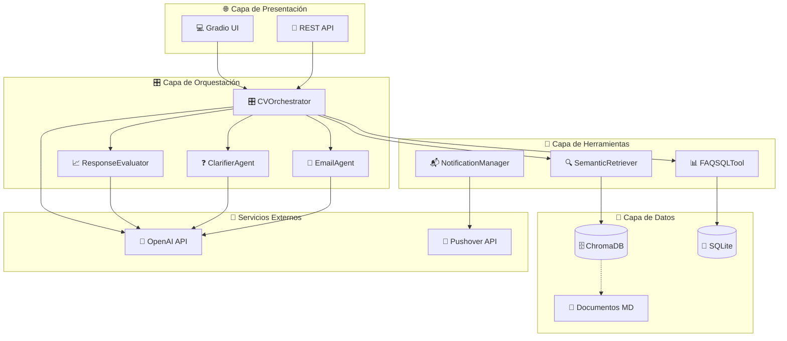
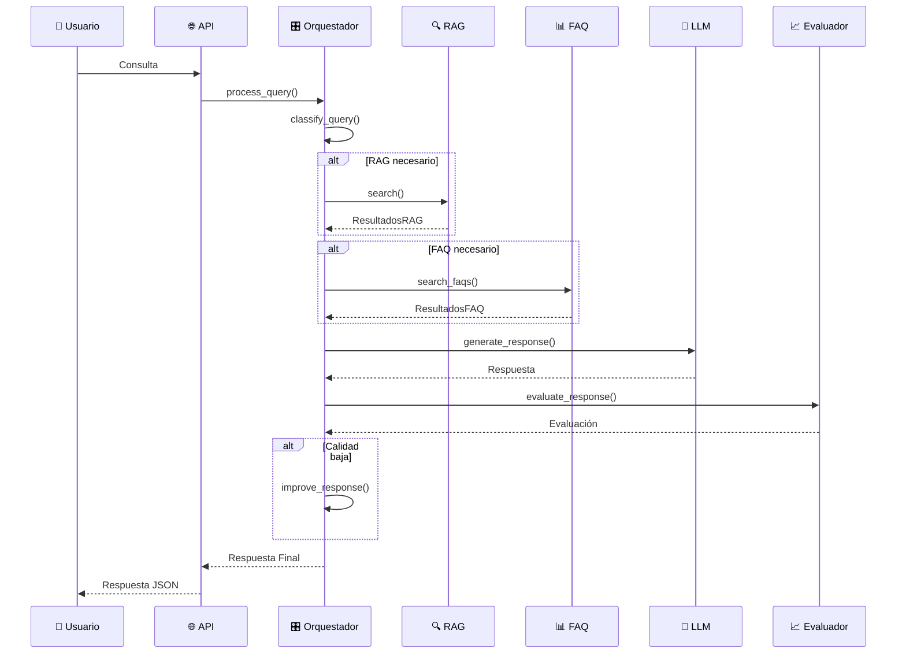
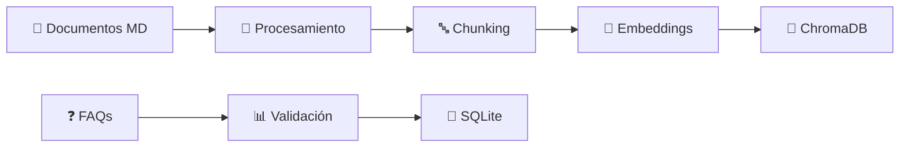
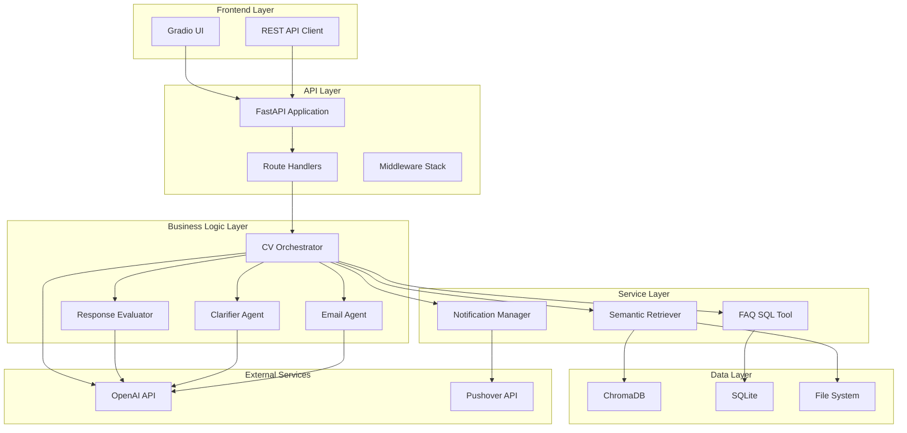
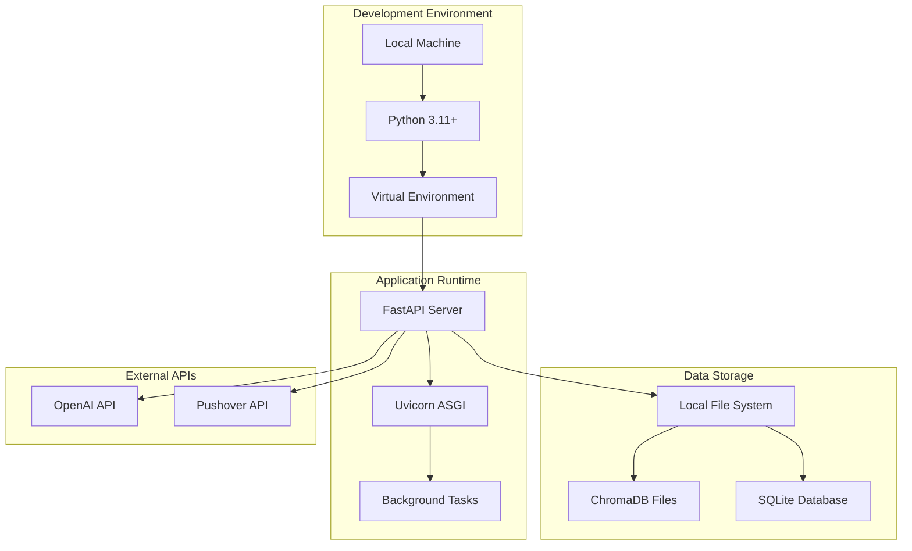

# 🏗️ Arquitectura de Software - Agente de CV Inteligente

## 📋 Índice

- [1. Visión General](#1-visión-general)
- [2. Arquitectura de Alto Nivel](#2-arquitectura-de-alto-nivel)
- [3. Componentes del Sistema](#3-componentes-del-sistema)
- [4. Patrones Arquitectónicos](#4-patrones-arquitectónicos)
- [5. Flujo de Datos](#5-flujo-de-datos)
- [6. Tecnologías y Stack](#6-tecnologías-y-stack)
- [7. Estructura de Directorios](#7-estructura-de-directorios)
- [8. Diagramas Arquitectónicos](#8-diagramas-arquitectónicos)
- [9. Decisiones Arquitectónicas](#9-decisiones-arquitectónicas)
- [10. Escalabilidad y Performance](#10-escalabilidad-y-performance)
- [11. Seguridad](#11-seguridad)
- [12. Monitoreo y Observabilidad](#12-monitoreo-y-observabilidad)

---

## 1. Visión General

El **Agente de CV Inteligente** es un sistema de inteligencia artificial basado en **RAG (Retrieval-Augmented Generation)** que proporciona respuestas inteligentes sobre experiencia profesional, proyectos y habilidades técnicas. La arquitectura está diseñada siguiendo principios de **modularidad**, **escalabilidad** y **mantenibilidad**.

### 1.1 Objetivos Arquitectónicos

- **Modularidad**: Componentes independientes y reutilizables
- **Escalabilidad**: Capacidad de manejar múltiples consultas concurrentes
- **Extensibilidad**: Fácil adición de nuevas herramientas y funcionalidades
- **Mantenibilidad**: Código limpio y bien estructurado
- **Performance**: Respuestas rápidas y eficientes

---

## 2. Arquitectura de Alto Nivel



---

## 3. Componentes del Sistema

### 3.1 Capa de Presentación

#### 3.1.1 API REST (FastAPI)
- **Ubicación**: `api/app.py`
- **Responsabilidad**: Exposición de endpoints HTTP para interacción externa
- **Características**:
  - Framework FastAPI con validación automática
  - Documentación automática OpenAPI/Swagger
  - Middleware CORS para integración web
  - Gestión de ciclo de vida de la aplicación
  - Manejo centralizado de excepciones

```python
# Estructura principal de la API
app = FastAPI(
    title="CV Agent API",
    description="API REST para el agente inteligente de CV",
    version="1.0.0",
    lifespan=lifespan
)
```

#### 3.1.2 Interfaz Web (Gradio)
- **Ubicación**: `api/ui_gradio.py`
- **Responsabilidad**: Interfaz de usuario web para interacción directa
- **Características**:
  - Interfaz conversacional intuitiva
  - Integración con la API REST
  - Configuración opcional

### 3.2 Capa de Orquestación

#### 3.2.1 CVOrchestrator
- **Ubicación**: `agent/orchestrator.py`
- **Responsabilidad**: Coordinación central del sistema
- **Funcionalidades**:
  - Clasificación inteligente de consultas
  - Selección automática de herramientas
  - Combinación de resultados de múltiples fuentes
  - Gestión de contexto y estado de sesión
  - Estadísticas y métricas de uso

```python
class CVOrchestrator:
    """Orquestador principal del agente de CV"""
    
    def __init__(self):
        self.semantic_retriever = SemanticRetriever()
        self.faq_tool = FAQSQLTool()
        self.notification_manager = NotificationManager()
        self.client = OpenAI()
        # ...
```

#### 3.2.2 ResponseEvaluator
- **Ubicación**: `agent/evaluator.py`
- **Responsabilidad**: Evaluación y mejora de respuestas
- **Características**:
  - Auto-crítica de respuestas generadas
  - Puntuación de calidad (1-10)
  - Sugerencias de mejora
  - Detección de respuestas inadecuadas

#### 3.2.3 ClarifierAgent
- **Ubicación**: `agent/clarifier.py`
- **Responsabilidad**: Clarificación de consultas ambiguas
- **Funcionalidades**:
  - Detección de consultas vagas o ambiguas
  - Generación de preguntas de clarificación
  - Gestión de diálogos de clarificación

#### 3.2.4 EmailAgent
- **Ubicación**: `agent/email_agent.py`
- **Responsabilidad**: Composición de emails profesionales
- **Características**:
  - Redacción automática de emails
  - Personalización basada en contexto
  - Múltiples estilos y tonos

### 3.3 Capa de Herramientas

#### 3.3.1 SemanticRetriever (RAG)
- **Ubicación**: `rag/retriever.py`
- **Responsabilidad**: Búsqueda semántica en documentos
- **Tecnologías**:
  - ChromaDB para almacenamiento vectorial
  - Sentence Transformers para embeddings
  - Búsqueda por similaridad coseno
  - Filtrado por umbral de relevancia

```python
@dataclass
class SearchResult:
    """Clase para representar un resultado de búsqueda"""
    content: str
    metadata: Dict[str, Any]
    score: float
    chunk_id: str
```

#### 3.3.2 FAQSQLTool
- **Ubicación**: `tools/faq_sql.py`
- **Responsabilidad**: Consultas a base de datos de FAQs
- **Características**:
  - Base de datos SQLite
  - Búsqueda por categorías y tags
  - Coincidencias parciales y fuzzy matching
  - Gestión de preguntas frecuentes

#### 3.3.3 NotificationManager
- **Ubicación**: `tools/notify.py`
- **Responsabilidad**: Gestión de notificaciones
- **Integraciones**:
  - Pushover API para notificaciones push
  - Alertas de sistema y métricas
  - Notificaciones de eventos importantes

### 3.4 Capa de Datos

#### 3.4.1 Base de Datos Vectorial (ChromaDB)
- **Ubicación**: `storage/vectordb/`
- **Contenido**: Embeddings de documentos de CV y proyectos
- **Características**:
  - Almacenamiento persistente
  - Búsqueda vectorial eficiente
  - Metadatos asociados a cada chunk

#### 3.4.2 Base de Datos Relacional (SQLite)
- **Ubicación**: `storage/sqlite/faq.db`
- **Esquema**:
```sql
CREATE TABLE faqs (
    id INTEGER PRIMARY KEY AUTOINCREMENT,
    question TEXT NOT NULL,
    answer TEXT NOT NULL,
    category TEXT,
    tags TEXT,  -- JSON string con tags
    created_at TIMESTAMP DEFAULT CURRENT_TIMESTAMP,
    updated_at TIMESTAMP DEFAULT CURRENT_TIMESTAMP
)
```

#### 3.4.3 Documentos Fuente
- **Ubicación**: `data/`
- **Estructura**:
  - `cv.md`: Currículum vitae principal
  - `proyectos/`: Documentos de proyectos específicos
  - `recortes/`: Artículos, publicaciones y presentaciones

---

## 4. Patrones Arquitectónicos

### 4.1 Repository Pattern
- Abstracción del acceso a datos
- Implementado en `SemanticRetriever` y `FAQSQLTool`

### 4.2 Strategy Pattern
- Selección dinámica de herramientas en el `CVOrchestrator`
- Diferentes estrategias según el tipo de consulta

### 4.3 Observer Pattern
- Sistema de notificaciones
- Eventos de sistema y métricas

### 4.4 Factory Pattern
- Creación de componentes en el ciclo de vida de la aplicación
- Gestión de dependencias

### 4.5 Chain of Responsibility
- Pipeline de procesamiento de consultas
- Evaluación y mejora de respuestas

---

## 5. Flujo de Datos

### 5.1 Flujo Principal de Consulta



### 5.2 Flujo de Ingestión de Datos



---

## 6. Tecnologías y Stack

### 6.1 Backend
- **Framework**: FastAPI 0.104.1
- **Server**: Uvicorn
- **Python**: 3.11+
- **Async**: AsyncIO para operaciones concurrentes

### 6.2 Inteligencia Artificial
- **LLM**: OpenAI GPT-4/GPT-3.5-turbo
- **Embeddings**: Sentence Transformers
- **Vector DB**: ChromaDB 0.4.20+
- **RAG**: LangChain 0.1.0+

### 6.3 Datos
- **Vector Store**: ChromaDB (persistente)
- **Relational DB**: SQLite
- **ORM**: SQLAlchemy 2.0.23
- **Procesamiento**: Pandas, NumPy

### 6.4 Interfaz
- **Web UI**: Gradio 4.7.1
- **API Docs**: OpenAPI/Swagger (automático)
- **CORS**: FastAPI middleware

### 6.5 Notificaciones
- **Push**: Pushover API
- **HTTP**: Requests 2.31.0

### 6.6 Configuración
- **Variables**: python-dotenv
- **Validación**: Pydantic 2.5.0

---

## 7. Estructura de Directorios

```
agente-cv/
├── 📚 agent/                    # Lógica de agentes IA
│   ├── clarifier.py            # Agente clarificador
│   ├── email_agent.py          # Agente de emails
│   ├── evaluator.py            # Evaluador de respuestas
│   ├── orchestrator.py         # Orquestador principal
│   └── prompts.py              # Plantillas de prompts
│
├── 🌐 api/                      # Capa de API REST
│   ├── app.py                  # Aplicación FastAPI principal
│   ├── background_tasks.py     # Tareas en background
│   ├── dependencies.py         # Gestión de dependencias
│   ├── exceptions.py           # Manejo de excepciones
│   ├── ui_gradio.py           # Interfaz web opcional
│   ├── models/                 # Modelos Pydantic
│   │   ├── requests.py         # Esquemas de request
│   │   └── responses.py        # Esquemas de response
│   └── routes/                 # Endpoints organizados
│       ├── chat.py             # Endpoints de chat
│       ├── health.py           # Health checks
│       ├── notifications.py    # Gestión de notificaciones
│       └── stats.py            # Estadísticas y métricas
│
├── 📁 data/                     # Documentos fuente
│   ├── cv.md                   # CV principal
│   ├── proyectos/              # Documentación de proyectos
│   └── recortes/               # Artículos y publicaciones
│
├── 🔍 rag/                      # Sistema RAG
│   ├── ingest.py               # Ingestión de documentos
│   └── retriever.py            # Búsqueda semántica
│
├── 💾 storage/                  # Almacenamiento de datos
│   ├── sqlite/                 # Base de datos relacional
│   │   └── faq.db              # FAQs
│   └── vectordb/               # Base de datos vectorial
│       └── chroma.sqlite3      # ChromaDB
│
├── 🔧 tools/                    # Herramientas especializadas
│   ├── faq_sql.py              # Herramienta SQL para FAQs
│   ├── notify.py               # Gestión de notificaciones
│   └── tool_schemas.py         # Esquemas JSON para tools
│
├── 🧪 examples/                 # Ejemplos y demos
│   └── agentic_patterns_demo.py
│
├── ⚙️ Configuración
│   ├── .env.example            # Variables de entorno
│   ├── requirements.txt        # Dependencias Python
│   ├── run_full_app.py         # Launcher completo
│   └── run_ui_only.py          # Solo interfaz web
│
└── 📖 Documentación
    ├── README.md               # Documentación principal
    ├── FUNCIONALIDAD.md        # Funcionalidades detalladas
    ├── ARQUITECTURA_SOFTWARE.md # Este documento
    └── REFACTORING_SUMMARY.md  # Resumen de refactoring
```

---

## 8. Diagramas Arquitectónicos

### 8.1 Diagrama de Componentes



### 8.2 Diagrama de Despliegue



---

## 9. Decisiones Arquitectónicas

### 9.1 ADR-001: Uso de FastAPI como Framework Web

**Fecha**: 2024-01-15  
**Estado**: Aceptado  

**Contexto**: Necesidad de una API REST rápida y moderna con documentación automática.

**Decisión**: Usar FastAPI como framework principal.

**Consecuencias**:
- ✅ Documentación automática OpenAPI
- ✅ Validación automática con Pydantic
- ✅ Soporte nativo para async/await
- ✅ Alto rendimiento
- ❌ Curva de aprendizaje para desarrolladores nuevos en FastAPI

### 9.2 ADR-002: ChromaDB para Almacenamiento Vectorial

**Fecha**: 2024-01-16  
**Estado**: Aceptado

**Contexto**: Necesidad de una base de datos vectorial eficiente para RAG.

**Decisión**: Usar ChromaDB como vector store principal.

**Consecuencias**:
- ✅ Fácil configuración y uso
- ✅ Almacenamiento persistente
- ✅ Soporte para metadatos
- ✅ Buena integración con Python
- ❌ Menos opciones de escalabilidad que alternativas enterprise

### 9.3 ADR-003: Patrón Orquestador Centralizado

**Fecha**: 2024-01-17  
**Estado**: Aceptado

**Contexto**: Necesidad de coordinar múltiples herramientas y fuentes de datos.

**Decisión**: Implementar un orquestador centralizado para gestión de consultas.

**Consecuencias**:
- ✅ Lógica centralizada y coherente
- ✅ Fácil adición de nuevas herramientas
- ✅ Control fino sobre el flujo de datos
- ❌ Punto único de fallo
- ❌ Posible cuello de botella en alta concurrencia

### 9.4 ADR-004: SQLite para FAQs

**Fecha**: 2024-01-18  
**Estado**: Aceptado

**Contexto**: Necesidad de almacenar preguntas frecuentes estructuradas.

**Decisión**: Usar SQLite para el almacenamiento de FAQs.

**Consecuencias**:
- ✅ Sin dependencias externas
- ✅ Consultas SQL familiares
- ✅ Transacciones ACID
- ✅ Backup y restore simples
- ❌ Limitaciones de concurrencia
- ❌ No adecuado para múltiples instancias

---

## 10. Escalabilidad y Performance

### 10.1 Estrategias de Escalabilidad

#### 10.1.1 Escalabilidad Vertical
- Optimización de consultas a ChromaDB
- Caching de embeddings frecuentes
- Pool de conexiones para SQLite

#### 10.1.2 Escalabilidad Horizontal
- Múltiples instancias FastAPI detrás de load balancer
- Particionamiento de datos vectoriales
- Base de datos distribuida para FAQs (PostgreSQL/MySQL)

### 10.2 Optimizaciones de Performance

#### 10.2.1 Caching
```python
# Cache de embeddings frecuentes
@lru_cache(maxsize=1000)
def get_embedding(text: str) -> List[float]:
    return model.encode(text)
```

#### 10.2.2 Procesamiento Asíncrono
```python
# Consultas concurrentes a múltiples fuentes
async def parallel_search(query: str):
    rag_task = asyncio.create_task(rag_search(query))
    faq_task = asyncio.create_task(faq_search(query))
    
    rag_results, faq_results = await asyncio.gather(
        rag_task, faq_task
    )
```

#### 10.2.3 Métricas de Performance
- Tiempo de respuesta por endpoint
- Latencia de consultas a vector DB
- Uso de memoria y CPU
- Rate limiting para prevenir abuse

---

## 11. Seguridad

### 11.1 Autenticación y Autorización
- API Keys para acceso a endpoints sensibles
- Rate limiting por IP/usuario
- Validación de input con Pydantic

### 11.2 Protección de Datos
- Variables de entorno para secrets
- Sanitización de inputs de usuario
- Logs sin información sensible

### 11.3 Comunicaciones Seguras
- HTTPS en producción
- Validación de certificados para APIs externas
- Encriptación de datos sensibles en BD

### 11.4 Implementación de Seguridad
```python
# Middleware de seguridad
from fastapi.security import HTTPBearer
from fastapi import HTTPException, status

security = HTTPBearer()

async def verify_token(token: str = Depends(security)):
    if not validate_api_key(token.credentials):
        raise HTTPException(
            status_code=status.HTTP_401_UNAUTHORIZED,
            detail="Invalid API key"
        )
```

---

## 12. Monitoreo y Observabilidad

### 12.1 Logging
```python
# Configuración de logging estructurado
import logging
import json

class JSONFormatter(logging.Formatter):
    def format(self, record):
        log_data = {
            'timestamp': self.formatTime(record),
            'level': record.levelname,
            'message': record.getMessage(),
            'module': record.module,
            'function': record.funcName
        }
        return json.dumps(log_data)
```

### 12.2 Métricas de Sistema
- Número de consultas por minuto/hora
- Tiempo de respuesta promedio
- Tasa de éxito/error
- Uso de recursos (CPU, memoria, disco)

### 12.3 Alertas y Notificaciones
```python
# Sistema de alertas integrado
async def check_system_health():
    metrics = await get_system_metrics()
    
    if metrics.error_rate > 0.05:  # 5%
        await notification_manager.send_alert(
            title="High Error Rate",
            message=f"Error rate: {metrics.error_rate:.2%}",
            priority=1
        )
```

### 12.4 Dashboard de Monitoreo
- Gradio dashboard para métricas en tiempo real
- Historial de consultas y respuestas
- Performance trends y análisis

---

## 📊 Resumen Arquitectónico

La arquitectura del **Agente de CV Inteligente** está diseñada con los siguientes principios fundamentales:

1. **Modularidad**: Cada componente tiene una responsabilidad específica y bien definida
2. **Extensibilidad**: Fácil adición de nuevas herramientas y funcionalidades
3. **Escalabilidad**: Diseño que permite crecimiento horizontal y vertical
4. **Mantenibilidad**: Código limpio, documentado y testeable
5. **Observabilidad**: Logging, métricas y monitoreo integral
6. **Seguridad**: Protección de datos y acceso controlado

Esta arquitectura proporciona una base sólida para un sistema de IA conversacional profesional, con la flexibilidad necesaria para evolucionar según las necesidades del negocio.

---

*Documento generado el: 3 de octubre de 2025*  
*Versión: 1.0*  
*Autor: GitHub Copilot*