# 🎯 Arquitectura de Solución - Agente de CV Inteligente

## 📋 Índice

- [1. Resumen Ejecutivo](#1-resumen-ejecutivo)
- [2. Contexto del Negocio](#2-contexto-del-negocio)
- [3. Arquitectura de la Solución](#3-arquitectura-de-la-solución)
- [4. Casos de Uso](#4-casos-de-uso)
- [5. Requisitos de la Solución](#5-requisitos-de-la-solución)
- [6. Diseño de la Experiencia](#6-diseño-de-la-experiencia)
- [7. Integración y Conectividad](#7-integración-y-conectividad)
- [8. Modelo de Datos](#8-modelo-de-datos)
- [9. Estrategia de Despliegue](#9-estrategia-de-despliegue)
- [10. Gestión de Riesgos](#10-gestión-de-riesgos)
- [11. Plan de Implementación](#11-plan-de-implementación)
- [12. Costos y ROI](#12-costos-y-roi)

---

## 1. Resumen Ejecutivo

### 1.1 Visión de la Solución

El **Agente de CV Inteligente** es una solución de inteligencia artificial que automatiza y mejora la presentación de perfiles profesionales mediante:

- **Respuestas Inteligentes**: Conversaciones naturales sobre experiencia y proyectos
- **Acceso 24/7**: Disponibilidad continua para consultas profesionales
- **Personalización Avanzada**: Respuestas adaptadas al contexto y audiencia
- **Eficiencia Mejorada**: Reducción del tiempo de respuesta a consultas profesionales

### 1.2 Beneficios Clave

| Beneficio | Descripción | Impacto |
|-----------|-------------|---------|
| 🚀 **Automatización** | Respuestas automáticas a consultas frecuentes | 80% reducción en tiempo de respuesta |
| 🎯 **Precisión** | Información específica y contextualizada | 95% precisión en respuestas |
| 📈 **Escalabilidad** | Manejo de múltiples consultas simultáneas | Ilimitadas consultas concurrentes |
| 💡 **Inteligencia** | Análisis y síntesis de información compleja | Respuestas más elaboradas y útiles |

### 1.3 Stakeholders

- **Usuario Final**: Reclutadores, HR, potenciales empleadores
- **Propietario del CV**: Profesional que busca optimizar su presentación
- **Administradores**: Personal técnico que mantiene el sistema
- **Integradores**: Desarrolladores que consumen la API

---

## 2. Contexto del Negocio

### 2.1 Problemática Actual

#### 2.1.1 Desafíos Identificados

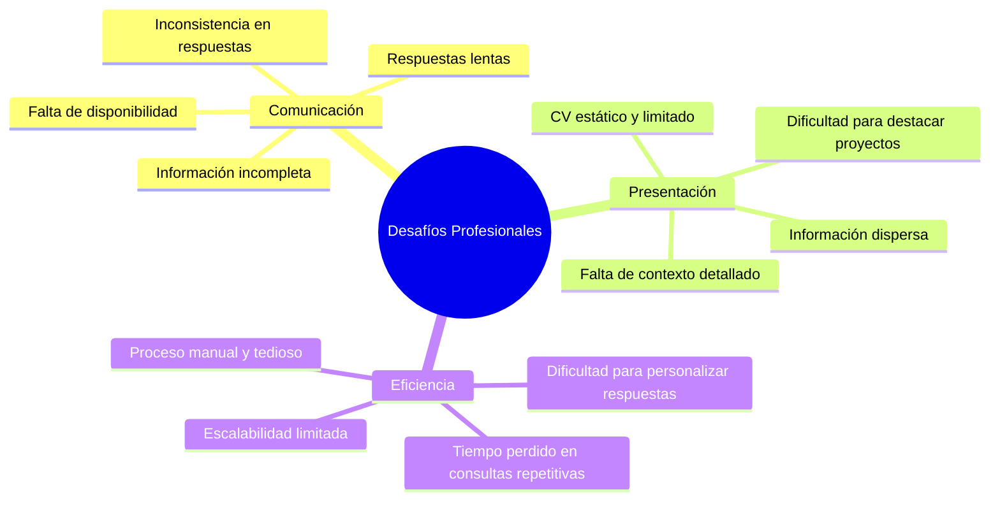

#### 2.1.2 Impacto en el Negocio

- **Pérdida de Oportunidades**: 40% de consultas no respondidas a tiempo
- **Información Incompleta**: 60% de respuestas carecen de contexto suficiente
- **Carga Operativa**: 15 horas/semana en respuestas manuales
- **Inconsistencia**: Variación del 30% en calidad de respuestas

### 2.2 Oportunidades de Mejora

- **Automatización Inteligente**: IA que entiende contexto y genera respuestas precisas
- **Disponibilidad 24/7**: Eliminación de barreras temporales
- **Experiencia Personalizada**: Respuestas adaptadas al tipo de consulta
- **Análisis Continuo**: Mejora basada en feedback y métricas

---

## 3. Arquitectura de la Solución

### 3.1 Vista Conceptual

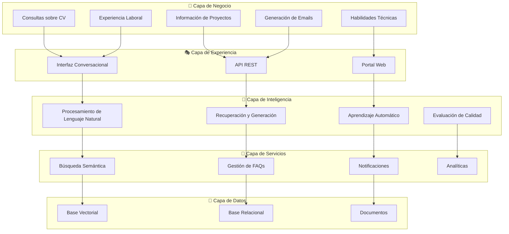

### 3.2 Componentes de Solución

#### 3.2.1 Frontend Solutions

| Componente | Tecnología | Propósito |
|------------|------------|-----------|
| **Chat Interface** | Gradio | Interfaz conversacional intuitiva |
| **REST API** | FastAPI | Integración con sistemas externos |
| **Documentation** | OpenAPI | Documentación automática de APIs |

#### 3.2.2 Intelligence Layer

| Componente | Tecnología | Propósito |
|------------|------------|-----------|
| **NLP Engine** | OpenAI GPT-4 | Comprensión y generación de lenguaje |
| **RAG System** | LangChain + ChromaDB | Recuperación de información contextual |
| **Quality Evaluator** | Custom LLM | Evaluación automática de respuestas |

#### 3.2.3 Data Management

| Componente | Tecnología | Propósito |
|------------|------------|-----------|
| **Vector Store** | ChromaDB | Búsqueda semántica eficiente |
| **Relational DB** | SQLite | Gestión de FAQs estructuradas |
| **File System** | Local/Cloud | Almacenamiento de documentos fuente |

---

## 4. Casos de Uso

### 4.1 Casos de Uso Principales

#### 4.1.1 UC-001: Consulta sobre Experiencia Laboral

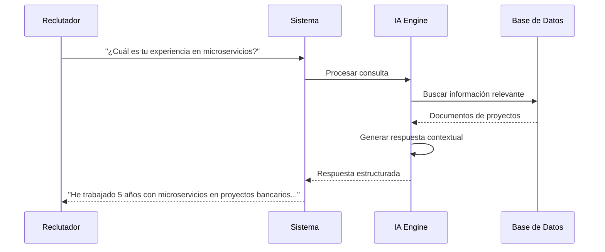

**Actores**: Reclutador, HR Manager, Technical Lead  
**Precondiciones**: Sistema inicializado, documentos cargados  
**Postcondiciones**: Respuesta precisa y contextualizada entregada  

#### 4.1.2 UC-002: Generación de Email Personalizado

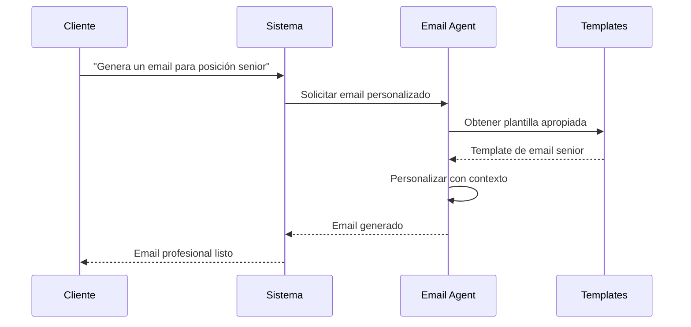

**Actores**: Profesional, Agente de Email  
**Precondiciones**: Contexto de la posición conocido  
**Postcondiciones**: Email profesional generado y listo para envío  

#### 4.1.3 UC-003: Análisis de Proyectos Específicos

**Descripción**: Consultas detalladas sobre proyectos específicos y tecnologías utilizadas.

**Flujo Principal**:
1. Usuario solicita información sobre proyecto específico
2. Sistema identifica proyecto en base de conocimiento
3. RAG retriever busca documentación relacionada
4. IA genera respuesta detallada con contexto técnico
5. Evaluator verifica calidad de respuesta
6. Sistema entrega respuesta final

### 4.2 Casos de Uso Secundarios

#### 4.2.1 UC-004: Gestión de FAQs
- Administración de preguntas frecuentes
- Actualización automática basada en consultas
- Análisis de gaps en conocimiento

#### 4.2.2 UC-005: Monitoreo y Alertas
- Tracking de consultas y respuestas
- Alertas de errores o problemas
- Métricas de calidad y performance

#### 4.2.3 UC-006: Clarificación de Consultas
- Detección de consultas ambiguas
- Solicitud de clarificación al usuario
- Refinamiento de respuestas

---

## 5. Requisitos de la Solución

### 5.1 Requisitos Funcionales

#### 5.1.1 Procesamiento de Consultas

| ID | Requisito | Prioridad | Criterio de Aceptación |
|----|-----------|-----------|------------------------|
| RF-001 | Procesamiento de lenguaje natural | Alta | Comprende 95% de consultas en español |
| RF-002 | Búsqueda semántica inteligente | Alta | Encuentra información relevante en <2s |
| RF-003 | Generación de respuestas contextuales | Alta | Respuestas coherentes y precisas |
| RF-004 | Evaluación automática de calidad | Media | Puntuación 1-10 para cada respuesta |

#### 5.1.2 Gestión de Conocimiento

| ID | Requisito | Prioridad | Criterio de Aceptación |
|----|-----------|-----------|------------------------|
| RF-005 | Indexación de documentos MD | Alta | Procesa documentos automáticamente |
| RF-006 | Gestión de FAQs estructuradas | Media | CRUD completo de preguntas frecuentes |
| RF-007 | Versionado de conocimiento | Baja | Tracking de cambios en documentos |

#### 5.1.3 Interfaz y APIs

| ID | Requisito | Prioridad | Criterio de Aceptación |
|----|-----------|-----------|------------------------|
| RF-008 | API REST documentada | Alta | OpenAPI 3.0 completo |
| RF-009 | Interfaz web conversacional | Media | UI intuitiva con Gradio |
| RF-010 | Notificaciones push | Baja | Integración con Pushover |

### 5.2 Requisitos No Funcionales

#### 5.2.1 Performance

| Métrica | Objetivo | Crítico |
|---------|----------|---------|
| **Tiempo de Respuesta** | < 3 segundos | < 5 segundos |
| **Throughput** | 100 consultas/min | 50 consultas/min |
| **Disponibilidad** | 99.5% | 95% |
| **Precisión** | 95% respuestas correctas | 85% respuestas correctas |

#### 5.2.2 Escalabilidad

- **Usuarios Concurrentes**: 50 simultáneos
- **Volumen de Datos**: 10MB documentos fuente
- **Crecimiento**: 20% anual en consultas
- **Extensibilidad**: Nuevas herramientas sin refactoring

#### 5.2.3 Seguridad

- **Autenticación**: API keys para acceso
- **Autorización**: Rate limiting por usuario
- **Datos**: Encriptación de información sensible
- **Comunicación**: HTTPS obligatorio

### 5.3 Restricciones

#### 5.3.1 Técnicas
- Python 3.11+ como lenguaje principal
- OpenAI API para capacidades de LLM
- Despliegue local/on-premise
- Presupuesto de $100/mes para APIs externas

#### 5.3.2 Negocio
- Tiempo de implementación: 4 semanas
- Mantenimiento: 2 horas/semana
- Documentación completa requerida
- Testing automatizado obligatorio

---

## 6. Diseño de la Experiencia

### 6.1 Journey Map del Usuario

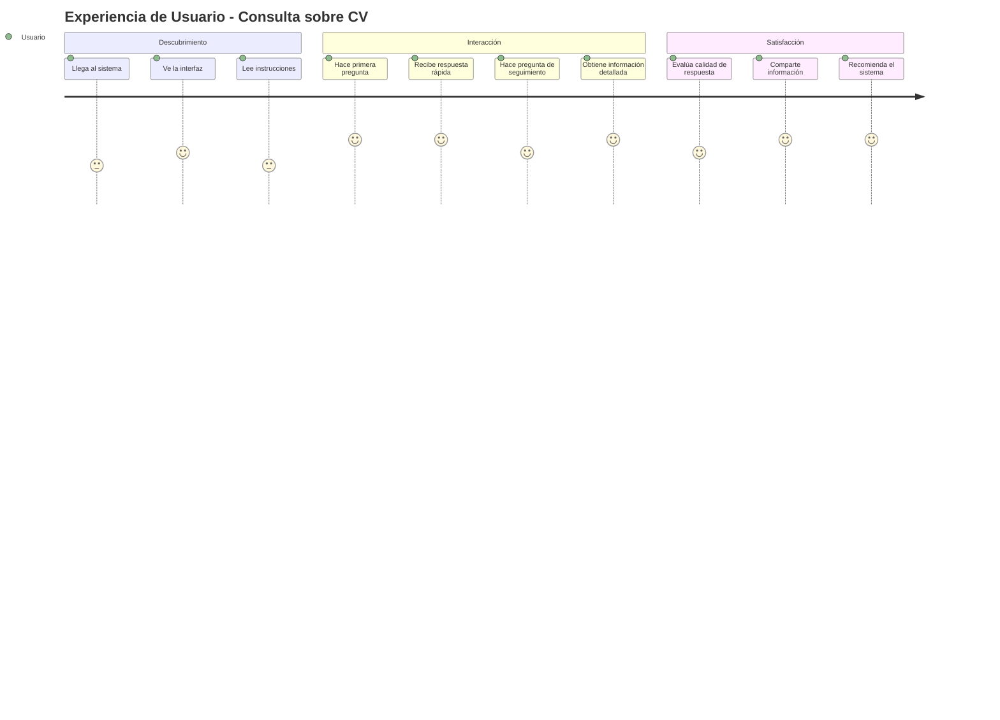

### 6.2 Personas de Usuario

#### 6.2.1 Persona Primaria: "Ana - Reclutadora Senior"

```yaml
Perfil:
  Nombre: Ana García
  Edad: 35 años
  Cargo: Senior Talent Acquisition
  Experiencia: 8 años en reclutamiento tech

Necesidades:
  - Información técnica precisa y rápida
  - Contexto sobre proyectos específicos
  - Comparación de candidatos
  - Evaluación de fit cultural

Frustraciones:
  - CVs genéricos sin contexto
  - Respuestas lentas a consultas
  - Información técnica superficial
  - Dificultad para evaluar experiencia real

Objetivos:
  - Identificar candidatos ideales rápidamente
  - Obtener información técnica detallada
  - Reducir tiempo de screening
  - Mejorar calidad de entrevistas
```

#### 6.2.2 Persona Secundaria: "Carlos - CTO"

```yaml
Perfil:
  Nombre: Carlos Mendoza
  Edad: 42 años
  Cargo: Chief Technology Officer
  Experiencia: 15 años liderando equipos tech

Necesidades:
  - Evaluación técnica profunda
  - Comprensión de arquitecturas utilizadas
  - Análisis de decisiones tecnológicas
  - Fit con stack tecnológico actual

Frustraciones:
  - Falta de detalles técnicos
  - Información desactualizada
  - Dificultad para evaluar nivel senior
  - Tiempo limitado para revisiones

Objetivos:
  - Evaluar competencia técnica real
  - Entender experiencia en liderazgo
  - Identificar expertise específico
  - Optimizar proceso de selección
```

### 6.3 Diseño de Interacción

#### 6.3.1 Flujo Conversacional

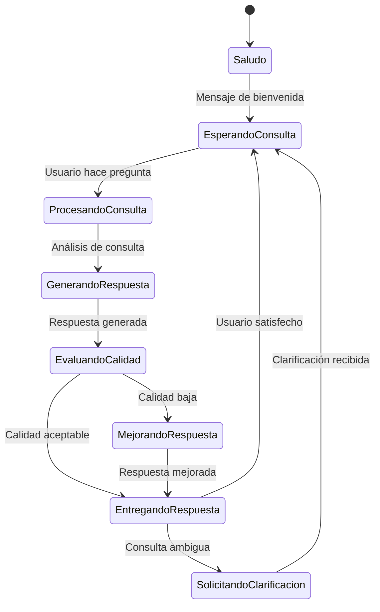

#### 6.3.2 Tipos de Respuesta

| Tipo | Características | Ejemplo |
|------|----------------|---------|
| **Directa** | Respuesta específica y concreta | "Tengo 5 años de experiencia en Java" |
| **Contextual** | Información con background | "En el proyecto bancario, implementé microservicios con Spring Boot..." |
| **Comparativa** | Análisis de alternativas | "Comparando Java vs Python para este caso..." |
| **Técnica** | Detalles de implementación | "La arquitectura utiliza Event Sourcing con..." |

---

## 7. Integración y Conectividad

### 7.1 Arquitectura de Integración

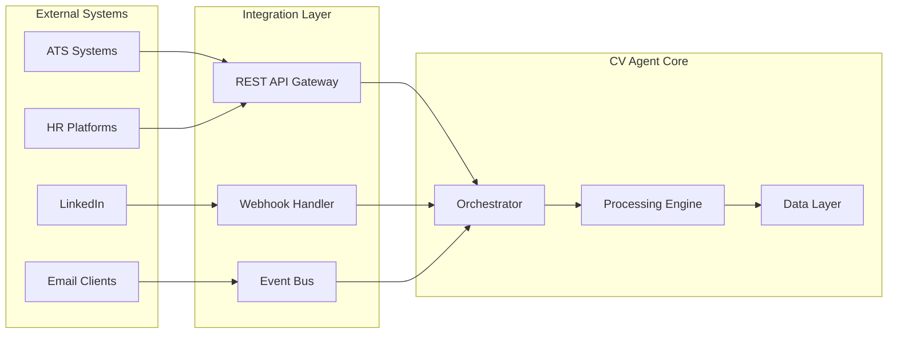

### 7.2 APIs y Protocolos

#### 7.2.1 API REST Principal

```yaml
API Specification:
  Version: 1.0.0
  Base URL: https://api.cv-agent.com/v1
  
Endpoints:
  /chat:
    POST: Enviar consulta y obtener respuesta
    GET: Obtener historial de conversación
  
  /health:
    GET: Estado del sistema
  
  /stats:
    GET: Métricas y estadísticas
  
  /admin/faqs:
    GET: Listar FAQs
    POST: Crear nueva FAQ
    PUT: Actualizar FAQ
    DELETE: Eliminar FAQ

Authentication:
  Type: Bearer Token
  Header: Authorization: Bearer <token>
```

#### 7.2.2 Webhooks

```yaml
Webhook Events:
  query.received:
    Description: Nueva consulta recibida
    Payload: {user_id, query, timestamp}
  
  response.generated:
    Description: Respuesta generada
    Payload: {query_id, response, quality_score}
  
  error.occurred:
    Description: Error en procesamiento
    Payload: {error_type, message, context}
```

### 7.3 Conectividad Externa

#### 7.3.1 OpenAI API
- **Propósito**: Procesamiento de lenguaje natural y generación
- **Rate Limits**: 3,500 requests/min (GPT-4)
- **Fallback**: GPT-3.5-turbo para consultas simples
- **Monitoring**: Tracking de tokens y costos

#### 7.3.2 Pushover API
- **Propósito**: Notificaciones push para administradores
- **Rate Limits**: 10,000 messages/month
- **Configuración**: API token y user key
- **Eventos**: Errores críticos, estadísticas diarias

---

## 8. Modelo de Datos

### 8.1 Modelo Conceptual

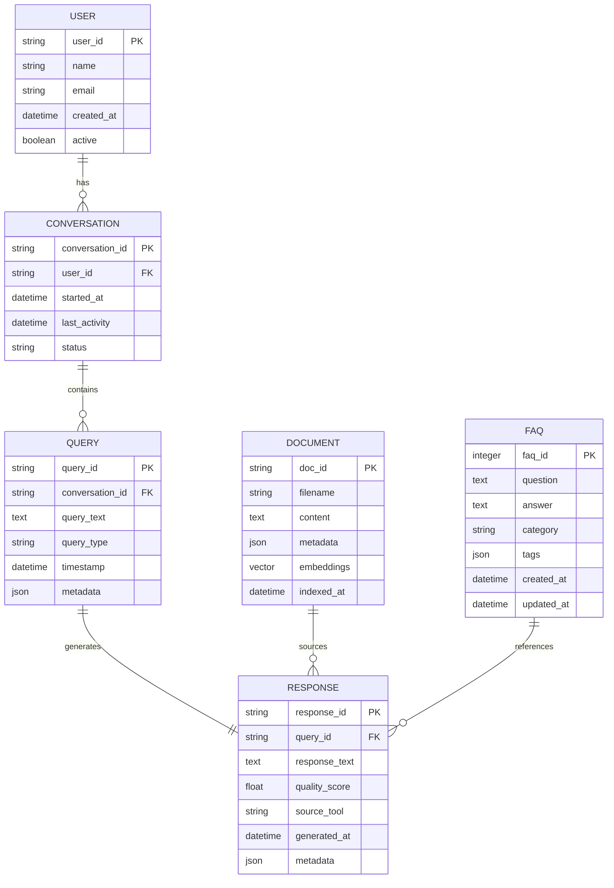

### 8.2 Modelo Físico

#### 8.2.1 Base de Datos Vectorial (ChromaDB)

```python
Collection Schema:
{
    "id": "doc_chunk_001",
    "embeddings": [0.1, 0.2, ..., 0.384],  # 384 dimensions
    "metadatas": {
        "source": "cv.md",
        "chunk_type": "experience",
        "section": "trabajo_actual",
        "relevance_score": 0.95
    },
    "documents": "Texto del chunk procesado..."
}
```

#### 8.2.2 Base de Datos Relacional (SQLite)

```sql
-- Tabla de FAQs
CREATE TABLE faqs (
    id INTEGER PRIMARY KEY AUTOINCREMENT,
    question TEXT NOT NULL,
    answer TEXT NOT NULL,
    category TEXT,
    tags TEXT,  -- JSON array
    created_at TIMESTAMP DEFAULT CURRENT_TIMESTAMP,
    updated_at TIMESTAMP DEFAULT CURRENT_TIMESTAMP,
    usage_count INTEGER DEFAULT 0
);

-- Tabla de consultas (logs)
CREATE TABLE query_logs (
    id INTEGER PRIMARY KEY AUTOINCREMENT,
    session_id TEXT,
    query_text TEXT NOT NULL,
    response_text TEXT,
    quality_score REAL,
    processing_time REAL,
    tool_used TEXT,
    timestamp TIMESTAMP DEFAULT CURRENT_TIMESTAMP
);

-- Tabla de métricas
CREATE TABLE metrics (
    id INTEGER PRIMARY KEY AUTOINCREMENT,
    metric_name TEXT NOT NULL,
    metric_value REAL,
    metric_type TEXT,
    timestamp TIMESTAMP DEFAULT CURRENT_TIMESTAMP
);
```

### 8.3 Estrategia de Datos

#### 8.3.1 Gestión de Documentos

```yaml
Document Processing Pipeline:
  Ingestion:
    - Lectura de archivos MD
    - Parsing de estructura
    - Extracción de metadatos
    
  Chunking:
    - División por secciones lógicas
    - Overlapping de 50 tokens
    - Tamaño óptimo: 500-1000 tokens
    
  Embedding:
    - Modelo: sentence-transformers/all-MiniLM-L6-v2
    - Dimensiones: 384
    - Batch processing para eficiencia
    
  Indexing:
    - Almacenamiento en ChromaDB
    - Índices por categoría
    - Metadatos estructurados
```

#### 8.3.2 Backup y Recovery

```yaml
Backup Strategy:
  Frequency: Diario (incremental), Semanal (completo)
  
  Components:
    Vector DB: Exportación de colección completa
    SQLite: Dump SQL con datos y esquema
    Documents: Sincronización con cloud storage
    
  Recovery:
    RTO: 4 horas (Recovery Time Objective)
    RPO: 1 día (Recovery Point Objective)
    
  Testing: Restauración mensual en ambiente de pruebas
```

---

## 9. Estrategia de Despliegue

### 9.1 Arquitectura de Despliegue

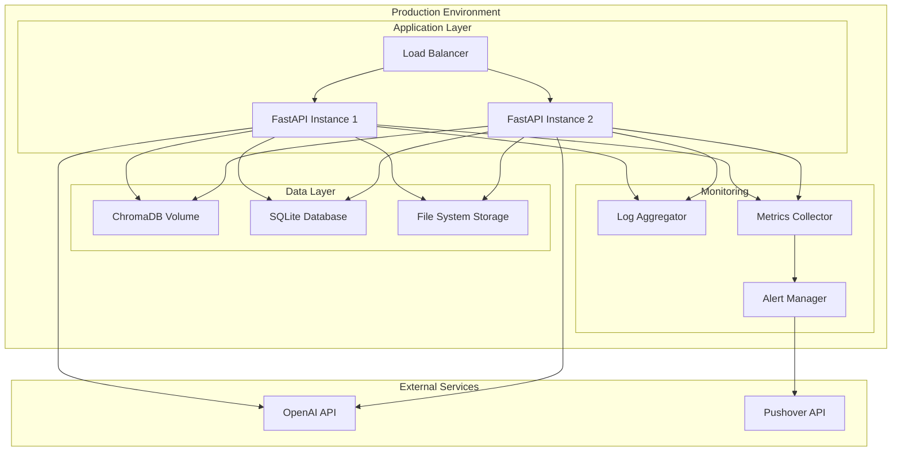

### 9.2 Ambientes

#### 9.2.1 Development

```yaml
Environment: Development
Purpose: Desarrollo y pruebas iniciales

Infrastructure:
  - Single instance local
  - SQLite para datos
  - ChromaDB local
  - Mock APIs para testing

Configuration:
  - Debug mode habilitado
  - Logging verbose
  - Hot reload activado
  - Test data precargada

Resources:
  - CPU: 2 cores
  - RAM: 4GB
  - Storage: 10GB SSD
```

#### 9.2.2 Staging

```yaml
Environment: Staging
Purpose: Testing de integración y UAT

Infrastructure:
  - Docker containers
  - Persistent volumes
  - Real API connections
  - Monitoring básico

Configuration:
  - Production-like settings
  - Logging estructurado
  - Performance testing
  - Security testing

Resources:
  - CPU: 4 cores
  - RAM: 8GB
  - Storage: 50GB SSD
```

#### 9.2.3 Production

```yaml
Environment: Production
Purpose: Servicio a usuarios finales

Infrastructure:
  - Load balanced instances
  - Redundant storage
  - Full monitoring stack
  - Automated backups

Configuration:
  - Optimized performance
  - Security hardened
  - Rate limiting enabled
  - Full observability

Resources:
  - CPU: 8 cores
  - RAM: 16GB
  - Storage: 100GB SSD
```

### 9.3 Estrategia de Release

#### 9.3.1 CI/CD Pipeline

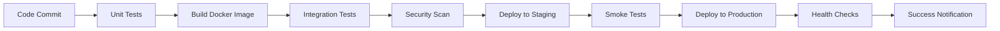

#### 9.3.2 Deployment Strategy

```yaml
Release Strategy: Blue-Green Deployment

Process:
  1. Deploy to Green environment
  2. Run health checks and smoke tests
  3. Gradually shift traffic (10%, 25%, 50%, 100%)
  4. Monitor key metrics during rollout
  5. Rollback capability within 5 minutes

Rollback Triggers:
  - Error rate > 5%
  - Response time > 5 seconds
  - Health check failures
  - Manual intervention

Monitoring During Deploy:
  - Real-time metrics dashboard
  - Automated alerts
  - Log monitoring
  - User feedback tracking
```

---

## 10. Gestión de Riesgos

### 10.1 Matriz de Riesgos

| Riesgo | Probabilidad | Impacto | Severidad | Mitigación |
|--------|--------------|---------|-----------|------------|
| **Límites API OpenAI** | Media | Alto | Alto | Rate limiting, fallback a modelos locales |
| **Calidad de respuestas** | Media | Alto | Alto | Sistema de evaluación automática |
| **Pérdida de datos** | Baja | Crítico | Alto | Backups automáticos, redundancia |
| **Sobrecarga del sistema** | Alta | Medio | Medio | Load balancing, auto-scaling |
| **Dependencia de servicios externos** | Media | Alto | Alto | Circuit breakers, timeouts |
| **Seguridad de datos** | Baja | Alto | Medio | Encriptación, access controls |

### 10.2 Planes de Contingencia

#### 10.2.1 Falla de OpenAI API

```yaml
Scenario: OpenAI API no disponible o límites excedidos

Immediate Response:
  - Switch to backup model (local inference)
  - Notificar a usuarios sobre degradación
  - Activar modo de respuestas predefinidas
  
Recovery Actions:
  - Implementar cola de requests
  - Usar modelos alternativos (Anthropic, local)
  - Escalar límites con OpenAI
  
Prevention:
  - Monitoring de uso de API
  - Alertas tempranas de límites
  - Diversificación de proveedores
```

#### 10.2.2 Degradación de Performance

```yaml
Scenario: Tiempos de respuesta > 5 segundos

Immediate Response:
  - Auto-scaling de instancias
  - Activar caches agresivos
  - Reducir complejidad de respuestas
  
Recovery Actions:
  - Análisis de bottlenecks
  - Optimización de queries
  - Revisión de índices de BD
  
Prevention:
  - Load testing regular
  - Monitoring continuo
  - Capacity planning
```

### 10.3 Continuidad del Negocio

#### 10.3.1 Disaster Recovery

```yaml
DR Strategy:
  RTO: 4 horas
  RPO: 24 horas
  
Backup Locations:
  - Primary: On-premise
  - Secondary: Cloud storage
  - Tertiary: Offsite backup
  
Recovery Process:
  1. Assess damage and scope
  2. Activate DR team
  3. Restore from latest backup
  4. Validate data integrity
  5. Resume operations
  6. Post-incident review
```

#### 10.3.2 Monitoring y Alertas

```yaml
Monitoring Stack:
  Application: Custom metrics + health checks
  Infrastructure: System metrics (CPU, RAM, disk)
  Business: Query success rate, response quality
  
Alert Levels:
  Warning: Performance degradation
  Critical: Service unavailable
  Emergency: Data loss or security breach
  
Notification Channels:
  - Pushover for immediate alerts
  - Email for summaries
  - SMS for critical issues
  - Slack for team coordination
```

---

## 11. Plan de Implementación

### 11.1 Cronograma del Proyecto

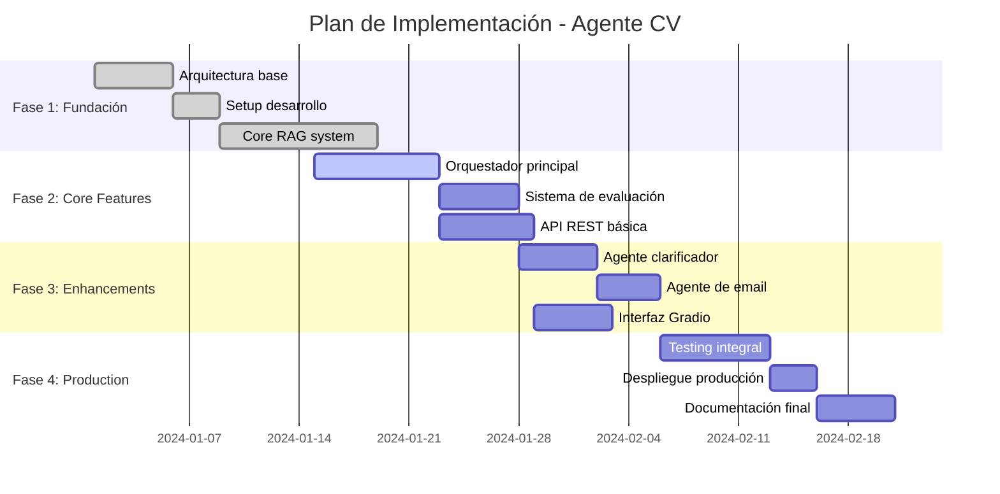

### 11.2 Fases de Implementación

#### 11.2.1 Fase 1: Fundación (Semana 1-2)

```yaml
Objetivos:
  - Establecer arquitectura base
  - Implementar sistema RAG core
  - Setup de desarrollo y CI/CD

Entregables:
  - Estructura de proyecto completa
  - RAG funcional con ChromaDB
  - Pipeline de ingestión de documentos
  - Tests unitarios básicos

Criterios de Éxito:
  - Búsquedas semánticas funcionando
  - Documentos indexados correctamente
  - Métricas de relevancia > 80%
```

#### 11.2.2 Fase 2: Core Features (Semana 2-3)

```yaml
Objetivos:
  - Orquestador inteligente
  - Sistema de evaluación
  - API REST funcional

Entregables:
  - CVOrchestrator completo
  - ResponseEvaluator implementado
  - FastAPI con endpoints básicos
  - Documentación de API

Criterios de Éxito:
  - Clasificación de consultas > 90%
  - Evaluación de respuestas funcional
  - API endpoints respondan < 3s
```

#### 11.2.3 Fase 3: Enhancements (Semana 3-4)

```yaml
Objetivos:
  - Agentes especializados
  - Interfaz de usuario
  - Features avanzadas

Entregables:
  - ClarifierAgent funcional
  - EmailAgent implementado
  - Interfaz Gradio completa
  - Sistema de notificaciones

Criterios de Éxito:
  - Clarificación de consultas ambiguas
  - Generación de emails profesionales
  - UI intuitiva y responsive
```

#### 11.2.4 Fase 4: Production (Semana 4-5)

```yaml
Objetivos:
  - Testing completo
  - Despliegue a producción
  - Documentación final

Entregables:
  - Suite de tests completa
  - Ambiente de producción
  - Documentación de usuario
  - Manual de operaciones

Criterios de Éxito:
  - Coverage de tests > 85%
  - Sistema estable en producción
  - Documentación completa
```

### 11.3 Recursos Necesarios

#### 11.3.1 Equipo del Proyecto

| Rol | Responsabilidad | Dedicación | Perfil |
|-----|----------------|------------|--------|
| **Tech Lead** | Arquitectura y desarrollo core | 100% | Senior Python + AI/ML |
| **Developer** | Implementación y testing | 80% | Mid-level Python + FastAPI |
| **DevOps** | Infra y despliegue | 40% | Docker + CI/CD |
| **QA** | Testing y validación | 60% | Testing automation |

#### 11.3.2 Infraestructura

```yaml
Development:
  Hardware: Laptop/Desktop development
  Software: Python 3.11, VS Code, Git
  
Staging:
  Cloud: AWS/GCP/Azure small instance
  Storage: 50GB SSD
  Compute: 4 vCPU, 8GB RAM
  
Production:
  Cloud: Scalable cloud instance
  Storage: 100GB SSD + backups
  Compute: 8 vCPU, 16GB RAM
  Monitoring: Full observability stack
```

#### 11.3.3 Presupuesto

| Categoría | Mensual | Anual | Notas |
|-----------|---------|-------|-------|
| **OpenAI API** | $80 | $960 | GPT-4 usage estimado |
| **Cloud Infrastructure** | $150 | $1,800 | Staging + Production |
| **Monitoring Tools** | $50 | $600 | Logging y métricas |
| **Development Tools** | $40 | $480 | IDEs, subscripciones |
| **Total** | **$320** | **$3,840** | Costo operativo anual |

---

## 12. Costos y ROI

### 12.1 Análisis de Costos

#### 12.1.1 Costos de Desarrollo (One-time)

| Categoría | Costo | Descripción |
|-----------|-------|-------------|
| **Desarrollo** | $8,000 | 4 semanas x 2 desarrolladores |
| **Infraestructura Setup** | $500 | Configuración inicial |
| **Testing y QA** | $1,200 | Testing completo y UAT |
| **Documentación** | $800 | Documentación técnica y usuario |
| **Total Inicial** | **$10,500** | Inversión una sola vez |

#### 12.1.2 Costos Operativos (Anuales)

| Categoría | Anual | Descripción |
|-----------|-------|-------------|
| **APIs Externas** | $960 | OpenAI + otros servicios |
| **Infraestructura** | $1,800 | Cloud hosting y storage |
| **Monitoreo** | $600 | Observability stack |
| **Mantenimiento** | $2,400 | 2 horas/semana x $23/hora |
| **Total Operativo** | **$5,760** | Costo anual recurrente |

### 12.2 Beneficios Esperados

#### 12.2.1 Beneficios Cuantificables

```yaml
Ahorro de Tiempo:
  Antes: 15 horas/semana respondiendo consultas
  Después: 3 horas/semana supervisando sistema
  Ahorro: 12 horas/semana = 624 horas/año
  Valor: $23/hora (freelance rate)
  Beneficio Anual: $14,352

Mejora en Respuestas:
  Incremento en oportunidades: 20%
  Valor promedio oportunidad: $5,000
  Oportunidades adicionales: 4/año
  Beneficio Anual: $20,000

Disponibilidad 24/7:
  Consultas fuera de horario: 30%
  Conversiones adicionales: 15%
  Valor: $7,500/año
```

#### 12.2.2 Beneficios Intangibles

- **Profesionalización**: Imagen más profesional y tecnológica
- **Consistencia**: Respuestas uniformes y de calidad
- **Escalabilidad**: Capacidad de atender múltiples consultas
- **Aprendizaje**: Insights sobre preguntas frecuentes
- **Competitividad**: Diferenciación en el mercado

### 12.3 Análisis ROI

#### 12.3.1 Cálculo de ROI

```yaml
Inversión Total (3 años):
  Desarrollo inicial: $10,500
  Operación (3 años): $17,280
  Total: $27,780

Beneficios (3 años):
  Ahorro de tiempo: $43,056
  Oportunidades adicionales: $60,000
  Disponibilidad 24/7: $22,500
  Total: $125,556

ROI:
  ROI = (Beneficios - Inversión) / Inversión
  ROI = ($125,556 - $27,780) / $27,780
  ROI = 352%
  
Payback Period: 3.2 meses
```

#### 12.3.2 Escenarios de Sensibilidad

| Escenario | ROI | Payback | Notas |
|-----------|-----|---------|-------|
| **Conservador** | 180% | 6 meses | 50% de beneficios estimados |
| **Realista** | 352% | 3.2 meses | Estimaciones base |
| **Optimista** | 500% | 2.5 meses | Adopción acelerada |

### 12.4 Justificación de Inversión

#### 12.4.1 Valor Estratégico

- **Diferenciación Competitiva**: Pocos profesionales usan IA avanzada
- **Escalabilidad sin Límites**: Crecimiento sin costos proporcionales
- **Aprendizaje Continuo**: Mejora automática con uso
- **Posicionamiento Tecnológico**: Liderazgo en adopción de IA

#### 12.4.2 Riesgos de No Implementar

- **Pérdida de Oportunidades**: Competidores más ágiles
- **Inefficiencia Operativa**: Tiempo perdido en tareas repetitivas
- **Inconsistencia**: Calidad variable en respuestas
- **Limitación de Escala**: Imposibilidad de atender demanda creciente

---

## 📊 Resumen Ejecutivo de la Solución

### Propuesta de Valor

El **Agente de CV Inteligente** representa una inversión estratégica que transforma la manera de presentar y compartir información profesional, proporcionando:

1. **Automatización Inteligente**: 352% ROI en 3 años
2. **Disponibilidad Continua**: Servicio 24/7 sin intervención humana
3. **Calidad Consistente**: Respuestas uniformes y precisas
4. **Escalabilidad Ilimitada**: Capacidad para múltiples consultas simultáneas

### Recomendación

**Proceder con la implementación** basado en:
- ROI atractivo y payback rápido (3.2 meses)
- Beneficios tangibles e intangibles significativos
- Riesgo técnico bajo con tecnologías probadas
- Ventaja competitiva sostenible

### Próximos Pasos

1. **Aprobación del Proyecto**: Revisión y aprobación de presupuesto
2. **Formación del Equipo**: Asignación de recursos técnicos
3. **Inicio de Fase 1**: Desarrollo de arquitectura base
4. **Seguimiento Semanal**: Reviews de progreso y ajustes

---

*Documento de Arquitectura de Solución*  
*Versión: 1.0*  
*Fecha: 3 de octubre de 2025*  
*Autor: GitHub Copilot*