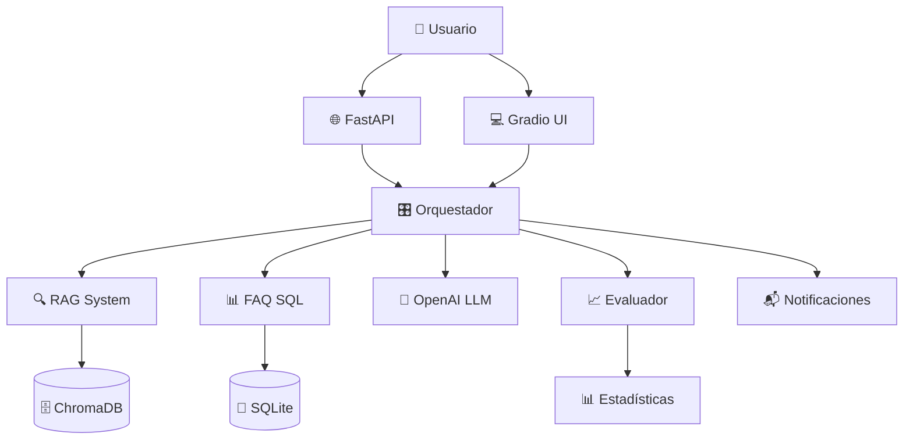

# 🤖 Agente de CV Inteligente - Documentación de Funcionalidad

## 📋 Índice
- [Descripción General](#descripción-general)
- [Arquitectura del Sistema](#arquitectura-del-sistema)
- [Componentes Principales](#componentes-principales)
- [Funcionalidades Detalladas](#funcionalidades-detalladas)
- [APIs y Endpoints](#apis-y-endpoints)
- [Uso del Sistema](#uso-del-sistema)
- [Ejemplos Prácticos](#ejemplos-prácticos)
- [Configuración](#configuración)
- [Troubleshooting](#troubleshooting)

---

## 🎯 Descripción General

El **Agente de CV Inteligente** es un sistema avanzado de inteligencia artificial que utiliza técnicas de **RAG (Retrieval-Augmented Generation)** y **herramientas especializadas** para responder preguntas sobre experiencia profesional, proyectos, habilidades técnicas y trayectoria laboral.

### ✨ Características Principales

- **🔍 RAG Semántico**: Búsqueda inteligente en documentos de CV y proyectos
- **📊 Base de FAQs**: Sistema SQL para preguntas frecuentes
- **🧠 Evaluación Automática**: LLM evaluador para auto-crítica y mejora
- **📬 Notificaciones**: Integración con Pushover para alertas
- **🌐 API REST**: Endpoint FastAPI para integración
- **💻 Interfaz Web**: UI con Gradio (opcional)
- **🎛️ Orquestador Inteligente**: Decide automáticamente qué herramienta usar

---

## 🏗️ Arquitectura del Sistema



### 📁 Estructura del Proyecto

```
agente-cv/
├── 📄 README.md                    # Documentación principal
├── 📋 requirements.txt             # Dependencias Python
├── ⚙️ .env                        # Variables de entorno
├── 📊 data/                       # Documentos fuente
│   ├── cv.md                      # CV principal
│   ├── proyectos/                 # Proyectos específicos
│   └── recortes/                  # Artículos y conferencias
├── 🔍 rag/                        # Sistema RAG
│   ├── ingest.py                  # Ingesta de documentos
│   └── retriever.py               # Búsqueda semántica
├── 🛠️ tools/                      # Herramientas especializadas
│   ├── faq_sql.py                 # Consultas FAQ
│   ├── notify.py                  # Notificaciones
│   └── tool_schemas.py            # Esquemas JSON
├── 🧠 agent/                      # Agente inteligente
│   ├── prompts.py                 # Prompts del sistema
│   ├── orchestrator.py            # Orquestador principal
│   └── evaluator.py               # Evaluador de respuestas
├── 🌐 api/                        # Interfaces
│   ├── app.py                     # API FastAPI
│   └── ui_gradio.py               # Interfaz web
└── 💾 storage/                    # Almacenamiento
    ├── vectordb/                  # Base de datos vectorial
    └── sqlite/                    # Base de datos SQL
```

---

## 🔧 Componentes Principales

### 1. 🎛️ **Orquestador (orchestrator.py)**

**Funcionalidad**: Componente central que decide qué herramientas usar y cómo combinar resultados.

**Características**:
- ✅ Clasificación automática de consultas
- ✅ Enrutamiento inteligente a herramientas apropiadas
- ✅ Combinación de múltiples fuentes de información
- ✅ Generación de respuestas contextualizadas

**Flujo de trabajo**:
1. **Recibe consulta** del usuario
2. **Clasifica** el tipo de pregunta (SIMPLE, COMPLEX, FAQ, etc.)
3. **Selecciona herramientas** apropiadas (RAG, FAQ, o combinado)
4. **Procesa** la información obtenida
5. **Genera respuesta** usando LLM con contexto
6. **Evalúa** la calidad de la respuesta

### 2. 🔍 **Sistema RAG (rag/)**

**Funcionalidad**: Búsqueda semántica en documentos usando embeddings.

**Componentes**:
- **`ingest.py`**: Procesa y vectoriza documentos markdown
- **`retriever.py`**: Realiza búsquedas semánticas

**Proceso**:
1. **Carga documentos** desde `data/`
2. **Divide en chunks** (1000 caracteres con overlap de 200)
3. **Genera embeddings** usando SentenceTransformers
4. **Almacena** en ChromaDB
5. **Busca** por similitud semántica

**Base de datos actual**:
- 📊 **6 documentos** procesados
- 📊 **59 chunks** indexados
- 🔍 Búsqueda por **similitud coseno**

### 3. 📊 **Sistema FAQ (tools/faq_sql.py)**

**Funcionalidad**: Base de datos SQL con preguntas frecuentes pre-definidas.

**Esquema de datos**:
```sql
CREATE TABLE faqs (
    id INTEGER PRIMARY KEY,
    question TEXT NOT NULL,
    answer TEXT NOT NULL,
    category TEXT,
    tags TEXT,  -- JSON array
    created_at TIMESTAMP,
    updated_at TIMESTAMP
);
```

**Categorías disponibles**:
- 🏷️ **tecnologias**: Habilidades técnicas
- 🏷️ **experiencia**: Años y trayectoria
- 🏷️ **industria**: Sectores trabajados
- 🏷️ **proyectos**: Proyectos destacados
- 🏷️ **educacion**: Formación académica

### 4. 📈 **Evaluador (evaluator.py)**

**Funcionalidad**: Evalúa automáticamente la calidad de las respuestas.

**Métricas**:
- 📊 **Puntuación general** (0-10)
- 📊 **Criterios específicos** (precisión, completitud, relevancia)
- 📊 **Fortalezas y debilidades**
- 📊 **Sugerencias de mejora**
- 📊 **Nivel de confianza**

---

## ⚙️ Funcionalidades Detalladas

### 🔄 **Clasificación de Consultas**

El sistema clasifica automáticamente las consultas en:

| Categoría | Descripción | Herramienta Recomendada |
|-----------|-------------|-------------------------|
| `SIMPLE` | Preguntas directas y básicas | FAQ |
| `COMPLEX` | Consultas que requieren análisis | RAG + LLM |
| `FAQ` | Preguntas frecuentes exactas | FAQ |
| `SPECIFIC` | Búsquedas muy específicas | RAG |
| `COMBINED` | Múltiples aspectos | RAG + FAQ + LLM |

### 🎯 **Estrategias de Respuesta**

1. **Solo FAQ**: Para preguntas directas
2. **Solo RAG**: Para búsquedas específicas en documentos
3. **Combinado**: Para consultas complejas que requieren múltiples fuentes
4. **LLM Directo**: Para consultas generales sin contexto específico

### 📊 **Sistema de Evaluación**

**Criterios de evaluación**:
- ✅ **Precisión**: ¿La información es correcta?
- ✅ **Completitud**: ¿Responde completamente la pregunta?
- ✅ **Relevancia**: ¿Es relevante para la consulta?
- ✅ **Claridad**: ¿Es fácil de entender?

**Niveles de calidad**:
- 🟢 **Alta** (7-10): Respuesta excelente
- 🟡 **Media** (5-6): Respuesta aceptable
- 🔴 **Baja** (0-4): Necesita mejora

---

## 🌐 APIs y Endpoints

### **FastAPI REST API**

**URL Base**: `http://localhost:8000`

#### 📋 **Endpoints Disponibles**

| Método | Endpoint | Descripción |
|--------|----------|-------------|
| `POST` | `/chat` | Enviar consulta al agente |
| `GET` | `/health` | Estado de salud del sistema |
| `GET` | `/stats` | Estadísticas del agente |
| `GET` | `/docs` | Documentación Swagger |
| `GET` | `/redoc` | Documentación ReDoc |

#### 💬 **POST /chat**

**Request Body**:
```json
{
    "message": "¿Cuáles son mis principales tecnologías?",
    "session_id": "user123",
    "include_evaluation": true,
    "include_metadata": true
}
```

**Response**:
```json
{
    "success": true,
    "response": "Mis principales tecnologías incluyen Java/Spring Boot, Python, React, AWS, Docker, Kubernetes, PostgreSQL, y arquitecturas de microservicios.",
    "metadata": {
        "classification": {
            "category": "FAQ",
            "confidence": 85,
            "recommended_tool": "FAQ"
        },
        "processing_time": 0.245,
        "tools_used": ["faq"],
        "context_length": 156,
        "session_id": "user123"
    },
    "evaluation": {
        "overall_score": 8.5,
        "criteria_scores": {
            "accuracy": 9.0,
            "completeness": 8.0,
            "relevance": 9.0,
            "clarity": 8.0
        },
        "strengths": ["Información precisa", "Respuesta completa"],
        "suggestions": ["Podría incluir más detalles sobre experiencia específica"]
    }
}
```

#### 📊 **GET /stats**

**Response**:
```json
{
    "total_queries": 45,
    "successful_responses": 42,
    "success_rate": 93.3,
    "average_response_time": 0.387,
    "tool_usage": {
        "faq": 18,
        "rag": 12,
        "combined": 15
    },
    "evaluation_stats": {
        "average_score": 7.8,
        "high_quality_responses": 38,
        "high_quality_rate": 84.4
    }
}
```

### **Gradio Web UI**

**URL**: `http://localhost:7860`

**Características**:
- 💬 Chat interactivo
- 📊 Visualización de estadísticas
- 🔍 Historial de consultas
- ⚙️ Configuración en tiempo real

---

## 🚀 Uso del Sistema

### **1. Instalación y Configuración**

```bash
# Clonar y configurar
git clone <repositorio>
cd agente-cv

# Crear entorno virtual
python -m venv venv
venv\Scripts\activate  # Windows

# Instalar dependencias
pip install -r requirements.txt

# Configurar variables de entorno
cp .env.example .env
# Editar .env con tu OPENAI_API_KEY

# Inicializar base de datos
python -m rag.ingest
```

### **2. Ejecución**

#### **API REST**:
```bash
python -m api.app
```

#### **Interfaz Web**:
```bash
python -m api.ui_gradio
```

#### **Uso Programático**:
```python
from agent.orchestrator import CVOrchestrator

orchestrator = CVOrchestrator()
response = orchestrator.process_query(
    "¿Qué experiencia tengo en microservicios?"
)
print(response)
```

---

## 💡 Ejemplos Prácticos

### **Consultas FAQ**

```python
# Tecnologías
"¿Cuáles son mis principales tecnologías?"
# → Respuesta directa desde FAQ

# Experiencia
"¿Cuántos años de experiencia tengo?"
# → Información sobre trayectoria profesional
```

### **Consultas RAG**

```python
# Proyectos específicos
"Háblame sobre el proyecto de banca digital"
# → Búsqueda semántica en documentos

# Detalles técnicos
"¿Qué arquitectura usé en el sistema de pagos?"
# → Análisis de documentos técnicos
```

### **Consultas Combinadas**

```python
# Análisis complejo
"¿Cómo mi experiencia en fintech me prepara para liderar un equipo de arquitectura?"
# → Combina FAQ + RAG + análisis LLM
```

---

## ⚙️ Configuración

### **Variables de Entorno (.env)**

```bash
# OpenAI Configuration
OPENAI_API_KEY=your_api_key_here
OPENAI_MODEL=gpt-3.5-turbo

# Database Paths
VECTORDB_PATH=./storage/vectordb
SQLITE_DB_PATH=./storage/sqlite/faq.db

# API Configuration
HOST=0.0.0.0
PORT=8000
DEBUG=false

# RAG Configuration
CHUNK_SIZE=1000
CHUNK_OVERLAP=200
TOP_K_RESULTS=5
SIMILARITY_THRESHOLD=0.7

# UI Configuration
GRADIO_PORT=7860
GRADIO_SHARE=false

# Notifications (Optional)
PUSHOVER_TOKEN=your_pushover_token
PUSHOVER_USER=your_pushover_user
```

### **Personalización de Datos**

#### **Agregar Documentos**:
1. Coloca archivos `.md` en `data/`
2. Ejecuta `python -m rag.ingest`

#### **Modificar FAQs**:
```python
from tools.faq_sql import FAQSQLTool

faq_tool = FAQSQLTool()
faq_tool.add_faq(
    question="¿Nueva pregunta?",
    answer="Nueva respuesta",
    category="nueva_categoria",
    tags=["tag1", "tag2"]
)
```

---

## 🔧 Troubleshooting

### **Problemas Comunes**

#### **Error: OpenAI API Key**
```
ERROR: OPENAI_API_KEY no está configurada
```
**Solución**: Configurar `.env` con clave válida

#### **Error: Quota Exceeded**
```
ERROR: You exceeded your current quota
```
**Solución**: Recargar créditos en OpenAI o usar solo FAQ/RAG

#### **Error: Base de datos vacía**
```
INFO: 0 resultados encontrados
```
**Solución**: Ejecutar `python -m rag.ingest`

#### **Error: Puerto ocupado**
```
ERROR: [Errno 10048] Only one usage of each socket address
```
**Solución**: Cambiar puerto en `.env` o cerrar aplicación existente

### **Logs y Debugging**

```bash
# Ver logs detallados
export DEBUG=true
python -m api.app

# Verificar bases de datos
python -c "
from rag.retriever import SemanticRetriever
from tools.faq_sql import FAQSQLTool

# Test RAG
retriever = SemanticRetriever()
print(f'RAG DB: {retriever.collection.count()} documentos')

# Test FAQ
faq = FAQSQLTool()
results = faq.search_faqs('test')
print(f'FAQ DB: {len(results)} FAQs disponibles')
"
```

---

## 📈 Métricas y Monitoreo

### **KPIs del Sistema**

- 📊 **Tasa de éxito**: % de consultas respondidas exitosamente
- ⏱️ **Tiempo de respuesta**: Promedio de tiempo de procesamiento
- 🎯 **Precisión**: Puntuación promedio de evaluaciones
- 🔧 **Uso de herramientas**: Distribución de herramientas utilizadas

### **Dashboards Disponibles**

1. **API Stats**: `/stats` endpoint
2. **Gradio UI**: Estadísticas en tiempo real
3. **Logs**: Archivos de log detallados

---

## 🔮 Roadmap y Mejoras Futuras

### **Próximas Características**

- [ ] 🌍 Soporte multiidioma
- [ ] 📊 Dashboard de analytics avanzado
- [ ] 🔌 Integración con LinkedIn
- [ ] 📅 Sincronización con calendarios
- [ ] 📄 Export a múltiples formatos
- [ ] 🤖 Entrenamiento continuo
- [ ] 🔐 Autenticación y autorización
- [ ] 📱 App móvil

### **Optimizaciones Técnicas**

- [ ] ⚡ Caché de respuestas
- [ ] 🔄 Actualización automática de datos
- [ ] 📊 Métricas avanzadas
- [ ] 🛡️ Validación de entrada mejorada
- [ ] 🔍 Búsqueda híbrida (semántica + keyword)

---

## 📞 Soporte y Contacto

Para soporte técnico, bugs o sugerencias:

- 📧 **Email**: [tu-email@ejemplo.com]
- 💬 **Issues**: GitHub Issues
- 📖 **Documentación**: `/docs` endpoint
- 🤝 **Contribuciones**: Pull requests bienvenidos

---

*Documentación generada el 1 de octubre de 2025*
*Versión del sistema: 1.0.0*