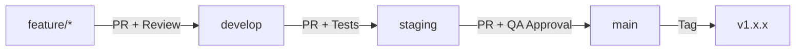

# Estrategia de Ramas Git - Agente CV

## 📋 Tabla de Contenidos
- [Visión General](#visión-general)
- [Estructura de Ramas](#estructura-de-ramas)
- [Flujo de Trabajo](#flujo-de-trabajo)
- [Comandos Comunes](#comandos-comunes)
- [Políticas de Merge](#políticas-de-merge)
- [Gestión de Documentación](#gestión-de-documentación)

---

## 🎯 Visión General

Este proyecto utiliza una estrategia de ramas basada en **Git Flow** para garantizar:
- ✅ Código estable en producción
- 🔄 Desarrollo continuo sin interrupciones
- 🧪 Pruebas exhaustivas antes de producción
- 🚀 Despliegues seguros y controlados

---

## 🌳 Estructura de Ramas

### Ramas Permanentes

#### 1. `main` (Producción)
- **Propósito**: Código en producción activo
- **Estabilidad**: Siempre estable y desplegable
- **Protección**: ⚠️ Protegida - Solo merge desde `staging` con PR
- **Tags**: Cada merge recibe un tag de versión (v1.0.0, v1.1.0, etc.)
- **CI/CD**: Deploys automáticos a producción

```bash
# Ver tags de versión
git tag -l
```

#### 2. `develop` (Desarrollo)
- **Propósito**: Rama principal de desarrollo
- **Estabilidad**: Generalmente estable, puede tener características en progreso
- **Protección**: Requiere revisión de código para merges
- **Integración**: Todas las features se integran aquí primero
- **CI/CD**: Deploys a ambiente de desarrollo

#### 3. `staging` (QA/Pre-producción)
- **Propósito**: Pruebas finales antes de producción
- **Estabilidad**: Candidato a producción
- **Protección**: Requiere aprobación de QA
- **Proceso**: Merge desde `develop` cuando está listo para pruebas
- **CI/CD**: Deploys a ambiente de staging/QA
- **Duración de pruebas**: 2-5 días típicamente

---

### Ramas Temporales

#### 4. `feature/*` (Características)
- **Nomenclatura**: `feature/nombre-descriptivo`
- **Ejemplos**:
  - `feature/multi-llm-support`
  - `feature/email-notifications`
  - `feature/rag-optimization`
- **Origen**: Se crean desde `develop`
- **Destino**: Se fusionan de vuelta a `develop`
- **Duración**: 1-2 semanas máximo
- **Eliminación**: Se borran después del merge

```bash
# Crear una feature
git checkout develop
git pull origin develop
git checkout -b feature/nombre-caracteristica
```

#### 5. `hotfix/*` (Correcciones Urgentes)
- **Nomenclatura**: `hotfix/descripcion-bug`
- **Ejemplos**:
  - `hotfix/api-timeout-error`
  - `hotfix/memory-leak-orchestrator`
- **Origen**: Se crean desde `main`
- **Destino**: Se fusionan a `main` Y `develop`
- **Urgencia**: Para bugs críticos en producción
- **Versión**: Incrementa el patch version (v1.0.0 → v1.0.1)

```bash
# Crear un hotfix
git checkout main
git pull origin main
git checkout -b hotfix/nombre-bug
```

#### 6. `release/*` (Preparación de Release) [Opcional]
- **Nomenclatura**: `release/v1.2.0`
- **Origen**: Desde `develop`
- **Destino**: Se fusiona a `main` y `develop`
- **Propósito**: Preparar una nueva versión (actualizar changelog, versiones, etc.)

---

## 🔄 Flujo de Trabajo

### Flujo Normal de Desarrollo



### Paso a Paso

#### 1️⃣ Desarrollar una Nueva Característica

```bash
# 1. Actualizar develop
git checkout develop
git pull origin develop

# 2. Crear rama de feature
git checkout -b feature/nombre-caracteristica

# 3. Desarrollar y commitear
git add .
git commit -m "feat: descripción de la característica"

# 4. Pushear a remoto
git push -u origin feature/nombre-caracteristica

# 5. Crear Pull Request a develop
# (Desde GitHub/GitLab interface)
```

#### 2️⃣ Integrar a Staging (QA)

```bash
# 1. Asegurar que develop esté actualizado
git checkout develop
git pull origin develop

# 2. Crear PR de develop a staging
# Esperar aprobación y merge

# 3. Actualizar staging localmente
git checkout staging
git pull origin staging
```

#### 3️⃣ Deploy a Producción

```bash
# 1. Después de QA exitoso en staging
git checkout staging
git pull origin staging

# 2. Crear PR de staging a main
# Requiere aprobación del tech lead

# 3. Después del merge, crear tag
git checkout main
git pull origin main
git tag -a v1.2.0 -m "Release version 1.2.0"
git push origin v1.2.0
```

#### 4️⃣ Hotfix de Emergencia

```bash
# 1. Crear hotfix desde main
git checkout main
git pull origin main
git checkout -b hotfix/bug-critico

# 2. Corregir el bug
git add .
git commit -m "fix: corrección de bug crítico"

# 3. Pushear
git push -u origin hotfix/bug-critico

# 4. Crear PR a main (urgente)
# 5. Después del merge, también mergear a develop
git checkout develop
git merge main
git push origin develop

# 6. Tag de patch version
git checkout main
git tag -a v1.2.1 -m "Hotfix: bug crítico"
git push origin v1.2.1
```

---

## 📝 Comandos Comunes

### Configuración Inicial

```bash
# Crear ramas principales (solo una vez)
git checkout -b develop
git push -u origin develop

git checkout -b staging
git push -u origin staging

# Volver a main
git checkout main
```

### Trabajo Diario

```bash
# Actualizar tu rama con los últimos cambios
git checkout develop
git pull origin develop
git checkout tu-feature-branch
git merge develop

# O usando rebase (más limpio)
git checkout tu-feature-branch
git rebase develop

# Ver estado de ramas
git branch -a
git log --oneline --graph --all --decorate

# Eliminar rama local después de merge
git branch -d feature/nombre-caracteristica

# Eliminar rama remota
git push origin --delete feature/nombre-caracteristica
```

### Sincronización

```bash
# Actualizar todas las referencias remotas
git fetch --all --prune

# Ver diferencias entre ramas
git diff develop..staging
git diff staging..main

# Ver commits únicos en una rama
git log develop..staging --oneline
```

---

## 🔒 Políticas de Merge

### Pull Request Requirements

#### Para `develop`:
- ✅ Al menos 1 revisor debe aprobar
- ✅ Todos los tests de CI deben pasar
- ✅ No conflictos de merge
- ✅ Descripción clara del cambio
- 📋 Commits con formato convencional

#### Para `staging`:
- ✅ Todos los requisitos de develop
- ✅ QA sign-off requerido
- ✅ Tests de integración pasados
- 📋 Actualización de CHANGELOG.md

#### Para `main`:
- ✅ Todos los requisitos de staging
- ✅ Aprobación del tech lead/product owner
- ✅ Tag de versión creado
- 📋 Release notes completados
- 🚀 Plan de rollback documentado

### Formato de Commits

Usar [Conventional Commits](https://www.conventionalcommits.org/):

```
feat: añadir soporte multi-LLM
fix: corregir timeout en API
docs: actualizar README con instrucciones Docker
style: formatear código con black
refactor: reorganizar estructura de agentes
test: añadir tests para clarifier
chore: actualizar dependencias
```

---

## 📚 Gestión de Documentación

### Estructura de Docs por Rama

```
docs/
├── current/           # Documentación de la rama actual (sincronizada)
├── main/             # Docs de producción (versión estable)
├── staging/          # Docs en QA
└── develop/          # Docs de desarrollo (puede estar adelantada)
```

### Reglas de Documentación

1. **Actualización Sincronizada**: La documentación SIEMPRE se actualiza con el código
2. **Versionado**: Cada release tiene su versión de docs
3. **README Principal**: Siempre refleja el estado de `main`
4. **Docs de Desarrollo**: Pueden tener features experimentales documentadas

### Archivos Clave por Rama

#### En todas las ramas:
- `README.md` - Información principal del proyecto
- `CHANGELOG.md` - Registro de cambios (actualizar antes de merge a main)
- `CONTRIBUTING.md` - Guías de contribución
- `GIT_WORKFLOW.md` - Este documento

#### Solo en `develop`:
- `docs/ROADMAP.md` - Próximas características
- `docs/WIP.md` - Trabajo en progreso
- Docs de features experimentales

#### Solo en `main`:
- `docs/RELEASE_NOTES.md` - Notas de versiones publicadas
- Docs de producción validadas

### Workflow de Documentación

```bash
# Al trabajar en una feature
1. Actualizar docs relevantes en tu feature branch
2. Incluir cambios de docs en el PR
3. Revisar que los docs estén sincronizados

# Antes de merge a staging
1. Actualizar CHANGELOG.md con cambios
2. Revisar que README refleje nuevas features
3. Actualizar diagramas si hay cambios arquitectónicos

# Antes de merge a main
1. Crear/actualizar RELEASE_NOTES.md
2. Actualizar versión en archivos relevantes
3. Generar documentación de API si aplica
```

---

## 🏷️ Versionado Semántico

Seguimos [Semantic Versioning 2.0.0](https://semver.org/):

```
v MAJOR . MINOR . PATCH
  └─┬─┘   └─┬─┘   └─┬─┘
    │       │       └─── Bug fixes, cambios menores (hotfix)
    │       └─────────── Nuevas features compatibles (release)
    └─────────────────── Cambios incompatibles, breaking changes
```

### Ejemplos:
- `v1.0.0` → `v1.0.1`: Hotfix de bug
- `v1.0.1` → `v1.1.0`: Nueva feature (multi-LLM)
- `v1.1.0` → `v2.0.0`: Breaking change (nueva API)

---

## 🛠️ Configuración de Protección de Ramas

### En GitHub/GitLab

1. **Settings** → **Branches** → **Add rule**

#### Para `main`:
```yaml
- Require pull request reviews: 2
- Require status checks to pass: true
- Require branches to be up to date: true
- Include administrators: true
- Restrict who can push: admins only
```

#### Para `develop`:
```yaml
- Require pull request reviews: 1
- Require status checks to pass: true
- Require branches to be up to date: false
```

#### Para `staging`:
```yaml
- Require pull request reviews: 1 (QA team)
- Require status checks to pass: true
- Require branches to be up to date: true
```

---

## 📊 Monitoreo y Métricas

### Comandos Útiles

```bash
# Ver actividad reciente por rama
git log --oneline --graph --all --since="2 weeks ago"

# Estadísticas de commits
git shortlog -sn --all --since="1 month ago"

# Ver ramas no mergeadas
git branch --no-merged develop

# Ver ramas ya mergeadas (para limpiar)
git branch --merged develop
```

---

## 🚨 Troubleshooting

### Conflictos de Merge

```bash
# Si hay conflictos al mergear
git checkout develop
git pull origin develop
git checkout tu-feature-branch
git merge develop
# Resolver conflictos manualmente
git add .
git commit -m "chore: resolver conflictos de merge"
```

### Revertir un Merge

```bash
# En caso de emergencia en main
git checkout main
git revert -m 1 <commit-hash-del-merge>
git push origin main
```

### Sincronizar Fork

```bash
# Si tienes un fork
git remote add upstream <url-repo-original>
git fetch upstream
git checkout develop
git merge upstream/develop
git push origin develop
```

---

## 📞 Soporte

- **Dudas sobre el workflow**: Revisar este documento primero
- **Conflictos complejos**: Consultar con el tech lead
- **CI/CD issues**: Revisar logs en GitHub Actions

---

## 📄 Referencias

- [Git Flow Original](https://nvie.com/posts/a-successful-git-branching-model/)
- [Conventional Commits](https://www.conventionalcommits.org/)
- [Semantic Versioning](https://semver.org/)
- [GitHub Flow](https://guides.github.com/introduction/flow/)

---

**Última actualización**: 2025-10-06
**Versión del documento**: 1.0.0
